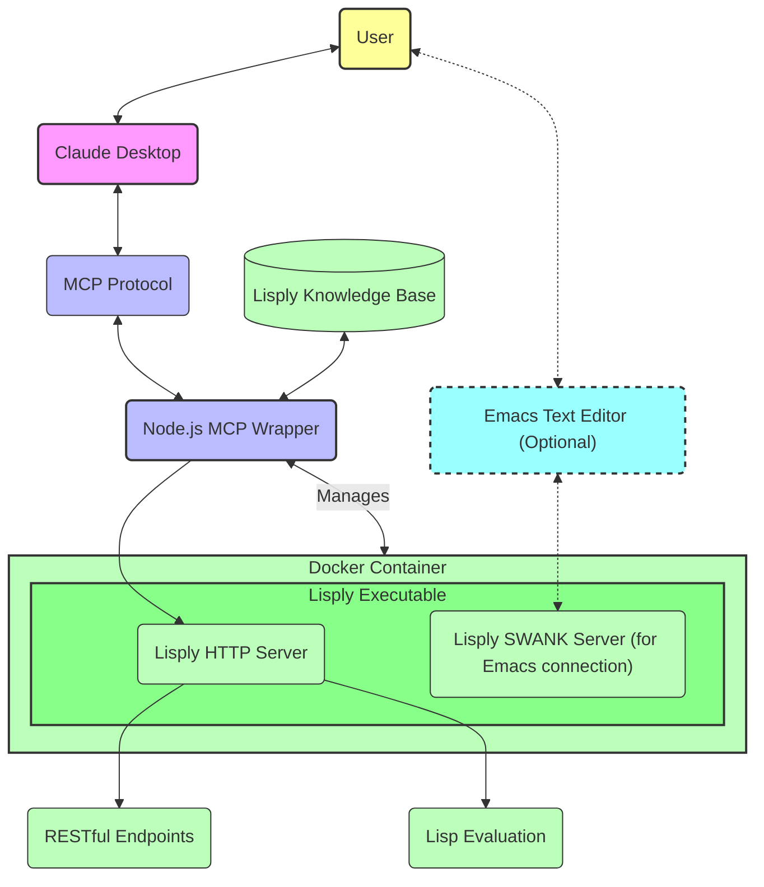

# Model Context Protocol (MCP) Wrapper for Lisp or Lisp-like Backends


This project is a [Model Context Protocol
(MCP)](https://modelcontextprotocol.org) software adapter that enables
[Large Language Models
(LLMs)](https://en.wikipedia.org/wiki/Large_language_model) to
interact with [Lisp-based development
environments](https://common-lisp.net/) using the lightweight Lisply
protocol.

## Who is this Project Aimed At?
 - AI practitioners curious about Lisp
 - Lisp practitioners curious about AI
 - CAD designers and automators
 - Mechanical engineers
 - Civil engineers
 - Engineers in any field
 - Tinkerers, meddlers, and tamperers from all walks of life

This adapter (also known as a "wrapper," or "MCP wrapper") connects
[MCP-capable](https://modelcontextprotocol.org) AI Agents, referred to
here as MCP Clients, such as [ClaudeDesktop](https://www.anthropic.com/claude),
to Lisp-speaking backend servers, to facilitate direct AI-assisted
symbolic programming. *For this project we have coined the term
"Lisply" to refer to a lightweightprotocol which any Lisp or
Lisp-like system can implement for compatibility with this Lisply-MCP adapter.

If you configure this adapter without specifying a backend container,
image name (or host/port for a remote Lisply service), then by
default it pulls and runs a
[Gendl](https://gitlab.common-lisp.net/gendl/gendl) container, which
speaks a Common Lisp superset. Work is also in progress on a second
reference Lisply backend implementation at the [Skewed
Emacs](https://github.com/gornskew/skewed-emacs) project, which aims
to launch an Emacs Lisp-speaking backend container image.


## Quick Start

### 1. Install

1. Make sure you have Node.js 18+ installed. If on Windows, this can
   be directly on Windows or in WSL.

2. Make sure you have an up-to-date Docker (20+ recommended)
   [installed](https://docs.docker.com/engine/install/) on the same
   host as where the Node.js is running this MCP wrapper script, e.g.,
   if the script is running through WSL, then Docker must also be
   installed in the WSL environment, and, likewise, if the Node script
   is running natively on Windows. Note that Docker Desktop is not
   needed in a WSL configuration; non-GUI Docker can be installed with
   standard Linux package managers.

3. Clone this repo with git to a location of your choice (i.e., a directory
   that Claude Desktop can access).
   
 
### 2. Add to AI Agent's Desktop Configuration (e.g., claude\_desktop\_config.json)

Add this to your `claude_desktop_config.json` or equivalent, typically
located at a path like those below (check your Claude Desktop docs for
the exact location):

```
/mnt/c/Users/<user>/AppData/Roaming/Claude/claude_desktop_config.json
```

or 

```
c:\Users\<user>\AppData\Roaming\Claude\claude_desktop_config.json
```

Replace `/path/to/cloned/` in the examples below with your actual repo
location.

Use unique server names for each instance, e.g. "lisply-gendl-1",
"lisply-gendl-2", etc.

```json
{
  "mcpServers": {
    "lisply-gendl-1": {
      "command": "node", 
      "args": [
        "/path/to/cloned/lisply-mcp/scripts/mcp-wrapper.js"
      ]
    }
  }
}
```


In a WSL scenario with the MCP Client running in Windows:

```json
{
  "mcpServers": {
    "lisply-gendl-2": {
      "command": "wsl", 
      "args": [
        "node", "/path/to/cloned/lisply-mcp/scripts/mcp-wrapper.js"
      ]
    }
  }
}
```


With volume mounting (useful for project access):
```json
{
  "mcpServers": {
    "lisply-gendl-3": {
      "command": "node",
      "args": [
        "/path/to/cloned/lisply-mcp/scripts/mcp-wrapper.js",
        "--mount", "/home/user/projects:/projects"
      ]
    }
  }
}
```

### 3. Available Tools for AI Agents

The wrapper exposes these MCP tools:

- `ping_lisp`: Check if the Lisply backend is running

- `lisp_eval`: Evaluate Lisp code directly in the Lisply backend

- `http_request`: Make HTTP requests to backend endpoints (this
  middleware wrapper script makes HTTP client requests to arbitrary
  endpoints at the Lisply backend's host and HTTP port).

**Important Note about Tools**:

- `lisp_eval` and `ping_lisp` are implemented directly by the backend
   Lisply server

 - `http_request` is implemented explicitly in this middleware and
   implicitly in the backend - it allows Claude to make HTTP requests
   to any endpoint on the Lisply backend server, where it's assumed
   that the Lisply backend may support certain custom-defined
   endpoints at the same http service port as configured in this
   wrapper.
  
 - The `mode` parameter for `lisp_eval` (http/stdio) is also handled
   explicitly by the middleware to choose how it communicates with the
   backend. The stdio mode is handled implicitly by the backend,
   because the backend must provide some kind of REPL as its
   foreground process in stdio mode, and those stdio streams will be
   used by this middleware wrapper to send `lisp_eval` requests and
   receive the results.


### 4. Example Lisp Evaluation

After setup and restarting your AI agent, the agent will be able to
use `lisp_eval` to run code as shown below:

**Syntax Note for the below examples:**

`the` is a special Gendl operator used to access messages in the
current object (implicit `self`) e.g., defined in a `define-object`
expression.

`theo` is a shorthand synonym for `the-object` and is used to send a
message to an object instance other than `self`, where said other
object goes as the first argument to `theo`.

For clarity:

```
(the ...)
``` 

expands exactly to 

```
(the-object self ...) ;;  == (theo self ...)
```

Messages may take arguments in parentheses:

```
(the message-name)            ; message to implicit self, message has no args.
(the (message-name arg1 arg2)) ; implicit self message with args
(theo object message-name)     ; explicit object, message without args.
(theo object (message-name arg1 arg2)) ; explicit object, message with args. 

```


```lisp
(in-package :gdl-user)
(defparameter *box* (make-object 'box :width 10 :length 3 :height 5))
```

```
(theo *box* volume) 
==> 150
```

## Table of Contents

- [Overview](#overview)
- [Architecture](#architecture)
- [Features](#features)
- [Detailed Installation](#detailed-installation)
- [Advanced Configuration](#advanced-configuration)
  - [Command-Line Arguments](#command-line-arguments)
  - [Environment Variables](#environment-variables)
- [Docker Integration](#docker-integration)
- [Communication Modes](#communication-modes)
- [Advanced Claude Desktop Configuration](#advanced-claude-desktop-configuration)
- [Real-World Examples](#real-world-examples)
- [Troubleshooting](#troubleshooting)
- [License](#license)

## Overview

The Lisply MCP wrapper is implemented in Node.js with a modular
architecture, and provides a bridge between an AI Agent and any
[compliant Lisply backend system](BACKEND-REQS.md). This wrapper
enables the AI Agent to:

1. Evaluate Lisp code in the Lisply Backend (LB).
2. Make HTTP requests to any endpoints implemented in the LB.
3. Access introspection and documentation lookup facilities in the LB.
4. Create, manipulate, compile, load, and analyze files through Lisp evaluation.
5. Interact with Lisp debuggers (for locally spawned containers).

### What is Lisply?

[Lisply](./BACKEND-REQS.md) is a lightweight protocol that specifies a
minimal yet flexible set of HTTP and standard input/output interfaces,
a standard set of environment variables, a Docker container image
naming convention, and several optional capabilities, to facilitate AI
agents controlling Lisp systems.

## Architecture

This MCP wrapper implements the Model Context Protocol (MCP) to
connect Claude or any other MCP-capable AI Agent (also known in this
context as an "MCP Client") with Lisply backend services. The below
diagram attempts to capture how the components interact:




The wrapper script handles:
1. Starting and managing a Lisply-compliant Docker container if needed
2. Routing requests between the AI Agent (e.g., Claude Desktop) and the Lisply Backend
3. Translating between the MCP protocol and the backend [Lisply
   API](BACKEND-REQS.md)
4. Error handling and logging

## Security Considerations

Because this adapter (wrapper) allows arbitrary Lisp code to be
evaluated against a running Lisply backend, best practices are:

- Allow the wrapper to connect only to a containerized version of a
  Lisply backend. If overriding default host/port, the wrapper will
  happily connect to any live Lisply-compliant http port. Avoid
  allowing this to happen for any http ports being served by programs
  running directly on your host.

- Make sure not to mount any valuable directories to that container;

- Take steps to [limit RAM and CPU
  usage](https://docs.docker.com/engine/containers/resource_constraints/)
  of the container (in a future release, this project aims to support
  these options as pass-through to the automated container
  startup). Typical options for reference: use `--memory=512m,
  --cpus=1, --cap-drop, --read-only`.  Avoid using `--network
  host`. Prefer isolated networks for safety.
  

### Code Modules/Files

- **lib/config.js**: Configuration loading and environment handling
- **lib/logger.js**: Logging functionality 
- **lib/docker.js**: Docker container management
- **lib/server.js**: HTTP server and MCP wrapper implementation
- **lib/utils.js**: Utility functions for response handling
- **handlers/**: Tool-specific request handlers
  - **initialize.js**: Initialization handler
  - **toolsList.js**: Tools list handler
  - **toolCall.js**: Main tool call dispatcher
  - **httpRequest.js**: HTTP request handler
  - **ping.js**: Ping handler
  - **lispEval.js**: Lisp evaluation handler
- **mcp-wrapper.js**: <--- Main entry point  <---


## Features

- **Configurable Lisply Host & Port**: Configure via command-line arguments or environment variables
- **Docker Container Management**: Automatically start Lisply container when needed 
- **Volume Mounting**: Mount host directories into the Lisply container
- **Run Self in Docker**: Run this wrapper directly on host or inside a container with Docker socket
- **Error Handling**: Detection and reporting of errors
- **Detailed Logging**: Detailed logs with timestamps and optional debug mode for more verbosity
- **Automatic Docker Image Selection**: Sensible defaults based on cloned branch and selected backend type
- **DockerHub Authentication**: Auto-pulls latest container images with authentication handling
- **Existing Service Detection**: Relies on existing live services when available, avoiding the need to start & stop a dedicated container
- **Multiple Communication Modes**: Support for both HTTP and stdio communication with interactive debugging capabilities
- **Modular Code Structure**: Well-organized code with clear separation of concerns for maintainability

## Detailed Installation

1. Clone this repository:
```bash
git clone https://github.com/gornskew/lisply-mcp.git
```

2. Install the required dependencies (optional, as the wrapper auto-installs dependencies):
```bash
cd lisply-mcp/scripts
npm install # optional - the script will attempt to do this also if needed
chmod +x mcp-wrapper.js # optional on some systems
```

3. Ensure Docker is installed on your system.

4. Test the script:
```bash
node mcp-wrapper.js --help
```

## Advanced Configuration

Optional settings for advanced users, with defaults suitable for most cases:

### Command-Line Arguments

```bash
Options:
  -H, --backend-host <host>            Lisply server host (default: 127.0.0.1)
  --swank-host-port <port>             SWANK port on host system (external) (default: 4201)
  --http-host-port <port>              HTTP port on host system (external) (default: 9081)
  --https-host-port <port>             HTTPS port on host system (external) (default: 9444)
  --telnet-host-port <port>            TELNET port on host system (external) (default: 4024)
  --http-port <port>                   HTTP port inside container (internal) (default: 9080)
  --https-port <port>                  HTTPS port inside container (internal) (default: 9443)
  --swank-port <port>                  SWANK port inside container (internal) (default: 4200)
  --telnet-port <port>                 TELNET port inside container (internal) (default: 4023)
  --image-base-name <n>                Base name for Docker image (default: dcooper8/gendl)
  --image-branch <branch>              Branch to use for Docker image (default: auto-detected)
  --docker-image <image>               Full Docker image for backend (overrides base name and branch)
  --lisp-impl <impl>                   Lisp implementation to use, ccl or sbcl (default: ccl)
  --no-auto-start                      Do not auto-start backend Docker container if not running
  --docker-socket <path>               Path to Docker socket (default: /var/run/docker.sock)
  --log-file <path>                    Path to log file (default: /tmp/lisply-mcp-wrapper.log)
  --debug                              Enable debug logging
  --mount <mounts...>                  Mount volumes in format "src:dst" (can specify multiple times)
  --start-http                         Start HTTP service in backend container (default: true)
  --start-https                        Start HTTPS service in backend container (default: false)
  --start-swank                        Start SWANK service in backend container (default: true)
  --start-telnet                       Start TELNET service in backend container (default: false)
  --no-use-stdio                       Disable stdio capability for local containers (default: false)
  --repl-prompt <pattern>              REPL prompt pattern to detect Lisp evaluation completion (default: ?)
  --eval-timeout <ms>                  Timeout for Lisp evaluation in milliseconds (default: 30000)
  --endpoint-prefix <prefix>           Prefix for all endpoints (default: lisply)
  --lisp-eval-endpoint <n>             Endpoint name for Lisp evaluation (default: lisp-eval)
  --http-request-endpoint <n>          Endpoint name for HTTP requests (default: http-request)
  --ping-endpoint <n>                  Endpoint name for ping (default: ping-lisp)
  -h, --help                           Display help for command
```

### Environment Variables

The script also supports configuration via environment variables. You
can specify variables with the "LISPLY_" prefix or with no prefix:

**Note:** It's important to keep straight the difference between host
ports (listening on and reachable from the host system) and container
ports (internal to the container, visible to the Lisply backend
service process):

| Environment Variable | Description | Default |
|----------------------|-------------|---------|
| `BACKEND_HOST` or `LISPLY_BACKEND_HOST` | Lisply server host | 127.0.0.1 |
| `SWANK_HOST_PORT` or `LISPLY_SWANK_HOST_PORT` | SWANK port on host system (external) | 4201 |
| `HTTP_HOST_PORT` or `LISPLY_HTTP_HOST_PORT` | HTTP port on host system (external) | 9081 |
| `HTTPS_HOST_PORT` or `LISPLY_HTTPS_HOST_PORT` | HTTPS port on host system (external) | 9444 |
| `TELNET_HOST_PORT` or `LISPLY_TELNET_HOST_PORT` | TELNET port on host system (external) | 4024 |
| `HTTP_PORT` or `LISPLY_HTTP_PORT` | HTTP port inside container (internal) | 9080 |
| `HTTPS_PORT` or `LISPLY_HTTPS_PORT` | HTTPS port inside container (internal) | 9443 |
| `SWANK_PORT` or `LISPLY_SWANK_PORT` | SWANK port inside container (internal) | 4200 |
| `TELNET_PORT` or `LISPLY_TELNET_PORT` | TELNET port inside container (internal) | 4023 |
| `START_HTTP` or `LISPLY_START_HTTP` | Start HTTP service | true |
| `START_HTTPS` or `LISPLY_START_HTTPS` | Start HTTPS service | false |
| `START_SWANK` or `LISPLY_START_SWANK` | Start SWANK service | true |
| `START_TELNET` or `LISPLY_START_TELNET` | Start TELNET service | false |
| `DOCKER_IMAGE` or `LISPLY_DOCKER_IMAGE` | Docker image for backend | (auto-detected) |
| `IMAGE_BASE` or `LISPLY_IMAGE_BASE` | Base name for Docker image | dcooper8/gendl |
| `IMAGE_BRANCH` or `LISPLY_IMAGE_BRANCH` | Branch for Docker image | (auto-detected) |
| `LISP_IMPL` or `LISPLY_LISP_IMPL` | Lisp implementation to use | ccl |
| `AUTO_START` or `LISPLY_AUTO_START` | Enable auto-starting container | true |
| `DOCKER_SOCKET` or `LISPLY_DOCKER_SOCKET` | Path to Docker socket | /var/run/docker.sock |
| `LOG_FILE` or `LISPLY_LOG_FILE` | Path to log file | /tmp/lisply-mcp-wrapper.log |
| `DEBUG_MODE` or `LISPLY_DEBUG_MODE` | Enable debug logging | false |
| `MOUNTS` or `LISPLY_MOUNTS` | Comma-separated mount points | (none) |
| `NO_USE_STDIO` or `LISPLY_NO_USE_STDIO` | Disable stdio capability | false |
| `REPL_PROMPT` or `LISPLY_REPL_PROMPT` | REPL prompt pattern | ? (depends on implementation) |
| `EVAL_TIMEOUT` or `LISPLY_EVAL_TIMEOUT` | Timeout for Lisp evaluation in ms | 30000 |
| `ENDPOINT_PREFIX` or `LISPLY_ENDPOINT_PREFIX` | Prefix for all endpoints | lisply |
| `LISP_EVAL_ENDPOINT` or `LISPLY_LISP_EVAL_ENDPOINT` | Endpoint name for Lisp evaluation | lisp-eval |
| `HTTP_REQUEST_ENDPOINT` or `LISPLY_HTTP_REQUEST_ENDPOINT` | Endpoint name for HTTP requests | http-request |
| `PING_ENDPOINT` or `LISPLY_PING_ENDPOINT` | Endpoint name for ping | ping-lisp |

## Docker Integration

This MCP wrapper can interact with both local and remote Lisply
backends. In the local case, the wrapper runs Docker commands to pull
and manage local Lisply backend containers.

### Docker Image Selection

The wrapper selects a default Docker image based on the detected
current git branch of your Lisply-MCP repository:

1. The Lisply Docker image naming convention follows the pattern:
   `${DOCKER_USER}/${IMAGE_BASE}:${IMAGE_BRANCH}-${LISP_IMPL}`
   - `${DOCKER_USER}` Username at hub.docker.com. defaults to `genworks`.
   - `${IMAGE_BASE}` Main name of the Lisply backend. Defaults to `gendl`.
   - `${IMAGE_BRANCH}` defaults to the current git branch name, if
     any, where the wrapper script is situated, with any slashes (`/`)
     converted to double hyphens (`--`)
     - For example, `release/1598` becomes `release--1598` in the image tag
     - `devo` branch will use the image tag `devo`
   - `${LISP_IMPL}` is the Lisp implementation in case the base Lisply
     backend sports multiple available Lisp flavors (e.g., ccl, sbcl
     are available for current public Gendl builds).

2. This wrapper script will attempt to pull or use an image matching
   your current branch:
   - First tries to pull the image matching your current branch from Docker Hub.
   - If pull fails, checks if the image exists locally.
   - If neither works, falls back to the `master` branch image.

3. You can override the automatic selection with:
   - The `--docker-image` command-line argument (overrides
    `--image-base-name` and `--image-branch` entirely)
   - The `--image-base-name` and/or `--image-branch` arguments
   - The `LISPLY_DOCKER_IMAGE` environment variable
   - The `LISPLY_IMAGE_BASE` and `LISPLY_IMAGE_BRANCH` environment variables

4. For the Lisp implementation:
   - Specify with `--lisp-impl` (ccl or sbcl for current gendl builds)
   - Or use the `LISPLY_LISP_IMPL` environment variable
   - Defaults to ccl if not specified

### Docker Hub Authentication

The wrapper will attempt to pull the latest version of the appropriate
Docker image before starting a container. This behavior includes:

1. Checking for Docker Hub authentication
2. Attempting to log in if not authenticated (using stored credentials or interactive login)
3. Pulling the latest image matching your configuration
4. Falling back to using a local image if pull fails
5. Attempting to pull the default image (master-ccl) as a last resort if needed


### Volume Mounting

You can mount host directories into the Lisply container to share
files between your host system and the container (note multiple mount
points can be specified):

```bash
{
  "mcpServers": {
    "lisply-gendl-4": {
      "command": "node",
      "args": [
        "/path/to/cloned/lisply-mcp/scripts/mcp-wrapper.js",
        "--mount", "/home/user/projects:/projects",
        "--mount", "/home/user/data:/data"
      ]
    }
  }
}

```

Or using environment variables:
```bash
LISPLY_MOUNTS=/home/user/projects:/projects,/home/user/data:/data node mcp-wrapper.js
```

Note the container runs with a certain UID, typically defaulting
to 1000. This may cause unexpected file ownerships if the Lisply
backend is writing to a mounted directory. This can be solved with
`docker exec` by sending commands to the container to change the UID
of the user running the service in the container. This behavior is
expected to be automated in a future version of this project. A
possible command could look like e.g.:

```
docker exec lisply-mcp-<hash> usermod -u 1001 lisply-user
```


### Existing Service Detection

The wrapper will check if a Lisply service is already running on the
specified host and ports and use it if it exists, before attempting to
start a container:

1. HTTP service (HTTP_HOST_PORT) is checked first as the primary service
2. SWANK service (SWANK_HOST_PORT) is checked as a fallback (and could
   potentially be used for debugging if it works and http
   didn't). 


#### Existing Services Override Local Container Settings

When an existing service is detected on the specified host and port
all Docker-related settings will be ignored:

   - `--docker-image`, `--image-base-name`, `--image-branch`, and `--lisp-impl`
   - `--mount` volume options
   - `--start-*` service flags
   - `--*-port` internal container port settings
   - `--docker-socket` path
   - `--no-auto-start` flag

The wrapper will display messages about which settings are being ignored.

The wrapper is intended to work with arbitrary local and remote
already-running Lisply-compliant services, in which case it doesn't
spawn any container at all.


## Communication Modes

This Lisply MCP wrapper supports two primary modes of communication
with configured Lisply backends: HTTP mode and stdio (Standard
Input/Output) mode.

### HTTP Mode

HTTP mode is the default communication method and works with both
local and remote Lisply backends. This mode uses the standard HTTP
endpoints that all Lisply backends are required to implement.

**Characteristics:**
- Structured responses with separate result and stdout fields
- Error handling that captures and returns errors as strings
- Compatible with all Lisply backends, local or remote
- Suitable for most casual use cases
- Response format: `Result: <result>, Stdout: <output>, Error: <any error>`

**Example response in HTTP mode:**
```
Result: 6, Stdout: This is a message to standard output
```

### Stdio Mode

Stdio mode provides more of a raw REPL experience for LLMs and enables
basic interactive debugging. This mode expects to leverage the
backend's native REPL interface and any included command-driven
debugger.

**Characteristics:**
- Raw REPL-like output without structured formatting
- Support for interactive debugger when errors occur
- Only available for local containers started by an instance of this
  MCP wrapper
- Ideal for development, debugging, and complex interactions
- Captures standard output followed by return-value of evaluated
  expressions in same stream

**Debugger Support:** When an error occurs in stdio mode, the Lisp
debugger can be interacted with. The wrapper detects debugger prompts
and provides metadata about the debugger state to the AI Agent. This
functionality relies on hardcoded prompt patterns in the wrapper code
which would need to be augmented to support new Lisply backends with
different REPL and debugger prompts.

**Mode Selection:**
- Default mode is HTTP.
- To use stdio mode for a particular tool call, specify `mode:
  "stdio"` in the `lisp_eval` tool parameters.
- Stdio mode can be banned for the session by configuring with the `--no-use-stdio` flag or
  `LISPLY_NO_USE_STDIO=true`.

If stdio mode is requested but banned or otherwise not available, the
wrapper will fall back to HTTP mode. LLM callers using stdio mode need
to be aware of this, because the response from the HTTP fallback comes
packaged in JSON instead of raw.

## Usage Examples 

All the examples below can be tested on command line and used in
`claude_desktop_config.json` configuration (see [Claude Desktop
Configuration](#claude-desktop-configuration)).

### Running in a Container

If running the wrapper itself inside a container, make sure to mount
the Docker socket (and some other port tricks may be necessary):

```bash
docker run -v /var/run/docker.sock:/var/run/docker.sock -v /path/to/scripts:/app node:18 node /app/mcp-wrapper.js
```

## Typical Setup

Here's a `claude_desktop_config.json` which sets up a convenience
filesystem-access mcp server as well as our `lisply-1` server with a
common mount, using this `scripts/mcp-wrapper.js` script, with some
typical custom options:


```json
{
  "mcpServers": {
    "filesystem": {
      "command": "wsl",
      "args": [
        "docker",
        "run",
        "-i",
        "--rm",
        "-u",
        "1000:1000",
        "--mount",
        "type=bind,src=/home/user/projects,dst=/projects",
        "mcp/filesystem",
        "/projects"
      ]
    },
    "lisply": {
      "command": "wsl",
      "args": [
        "node",
        "/home/user/projects/lisply-mcp/scripts/mcp-wrapper.js",
        "--mount", "/home/user/projects:/projects"
      ],
      "env": {
        "NODE_ENV": "production",
        "DEBUG": "*"
      }
    }
  },
  "globalShortcut": ""
}
```

### Tool Details for Claude

#### Lisp Evaluation Tool (`lisp_eval`)

The `lisp_eval` tool allows Claude to evaluate Lisp code directly
within the Lisply environment with these parameters:

- `code` (required): The Lisp code to evaluate
- `package` (optional): The package to use for the evaluation
- `mode` (optional): The mode to use to talk to Lisply
  - `http` (default): Uses HTTP communication for structured responses
  - `stdio`: Uses standard input/output communication for a raw REPL experience

**Mode Comparison:**

| Feature | HTTP Mode | STDIO Mode |
|---------|-----------|------------|
| Response Format | Structured with separate Result and Stdout fields | Raw REPL-like output |
| Error Handling | Traps errors and returns them as strings | Can enter interactive debugger |
| Debugger Support | No interactive debugging | Supports interactive debugger |
| Compatibility | Works with local & remote servers | Only for local containers started by MCP |
| Use Case | Clean integration, simple queries | Development, debugging, complex interactions |


#### HTTP Request Tool (`http_request`)

The `http_request` tool enables the AI Agent to interact with any HTTP
endpoint exposed by the Lisply backend (the following example works
with our default backend):

```json
{
  "path": "/color-map",
  "method": "GET",
  "headers": {
    "Accept": "application/json"
  }
}
```

#### Ping Tool (`ping_lisp`)

The `ping_lisp` tool lets Claude check if the Lisply server is running:

```
ping_lisp()
```

## Real-World Examples

### Example 1: Creating a Parametric Box

In this example, Claude creates a parametric box in the Lisply
environment and then modifies its properties based on user
requirements.

**User**: "Can you create a box with width 10, height 5, and depth 3?
Then show me how to change the height to 8."

**Claude**:

I'll create a parametric box using the lisp_eval tool, then show you
how to modify its height.

First, let's create the box with the specified dimensions:

```lisp
(in-package :gdl-user)

;; First, create a box with the specified dimensions
(defparameter *my-box* (make-object 'box 
                         :width 10 
                         :height 5 
                         :length 3))

;; Let's verify the dimensions
(list (theo *my-box* width)
      (theo *my-box* height)
      (theo *my-box* length))
```

Now, let's change the height from 5 to 8:

```lisp
;; Change the height using setf with accessor
(theo *my-box* (set-slot! :height 8))

;; Alternatively, we could create a new box
(defparameter *new-box* (make-object 'box 
                         :width 10 
                         :height 8  ;; Updated height
                         :length 3))

;; Verify the new dimensions of original box
(list (theo *my-box* width)
      (theo *my-box* height)
      (theo *my-box* length))
```

This box can be visualized by creating a web interface or using
built-in visualization tools. See [Gendl
Documentation](https://gornschool.com) for details.


### Example 2: Demonstrating the Difference Between HTTP and Stdio Modes

**User**: "Can you show me the difference between HTTP and stdio modes
by evaluating a simple expression that prints something to standard
output and returns a value?"

**AI Agent**:

I'll demonstrate the difference between HTTP and stdio modes by
evaluating a simple Lisp expression that both prints output and
returns a value.

First, let's use HTTP mode (the default):

```lisp
(progn 
  (format t "This is a message to standard output~%") 
  (+ 1 2 3))
```

Response in HTTP mode:
```
Result: 6, Stdout: This is a message to standard output
```

Now, let's use stdio mode for the same expression:

```lisp
;; Using mode: stdio
(progn 
  (format t "This is a message to standard output~%") 
  (+ 1 2 3))
```

Response in stdio mode:
```
This is a message to standard output
6
```

Notice the difference: HTTP mode provides a structured response with
labeled Result and Stdout sections, while stdio mode gives you the raw
REPL output exactly as it appears in the Lisp REPL.

Stdio mode is particularly useful for debugging because it can show
you interactive debugger prompts. For example, if we introduce an
error:

```lisp
;; Using mode: stdio
(progn
  (format t "About to generate an error~%")
  (/ 1 0))
```

In stdio mode, you might see something like:
```
About to generate an error
> Error: Division by zero
> While executing: /
> Type :help for debugging options
```

This allows the LLM to interact with the debugger directly. In HTTP
mode, you would just get an error message without the interactive
capabilities.

## Troubleshooting

### Common Issues and Solutions

#### Container Won't Start

If the Lisply container fails to start:

1. Check if Docker is running:
```bash
docker info
```

2. Check if the ports are already in use:
```bash
sudo lsof -i :4201
sudo lsof -i :9081
```

3. Verify that the Docker image exists:
```bash
docker images | grep genworks
```

4. Try pulling the image manually:
```bash
docker pull genworks/gendl:master-ccl
```

#### Connection Errors

If the LLM Agent / MCP Client cannot connect to the configured Lisply
backend:

1. Check if the Lisply server is running:
```bash
docker ps | grep lisply
```

2. Enable debug logging:
```json
{
  "mcpServers": {
    "lisply": {
      "command": "wsl", 
      "args": [
        "node",
        "/path/to/cloned/lisply-mcp/scripts/mcp-wrapper.js"
      ]
    }
  }
}
```

3. Check the wrapper's log file:
```bash
tail -f /tmp/lisply-mcp-wrapper.log
```

4. Check the Claude Desktop log file with Windows tools
   e.g. Notepad. This is typically something along the lines of:

WSL/Linux:
```
/mnt/c/Users/<user>/AppData/Roaming/Claude/logs/mcp-server-lisply.log
```

Windows:
```
c:\Users\<user>\AppData\Roaming\Claude\logs\mcp-server-lisply.log
```


5. Try curling to the Lisply HTTP server:
```bash
curl http://localhost:9081/lisply/ping-lisp
```

6. Try connecting to the Lisply SWANK server (on default port 4201):
```bash
M-x slime-connect  ;; from emacs
```

#### Permission Issues

If you encounter permission errors:

1. Check Docker socket permissions:
```bash
ls -l /var/run/docker.sock
```

2. Make sure your user has permission to access Docker:
```bash
sudo usermod -aG docker $USER
```

3. Check mounted directory permissions:
```bash
ls -l /path/to/mounted/directory
```

Note: Files created by the Lisply backends may end up owned by
different users. This can be fixed with certain `docker exec` commands
which we hope to automate, for example one approach is to modify the
UID of the running user in the container at startup to match the host
user. Implementation note: Simply passing a `-u` argument to the
`docker run` command as we see in the `mcp/filesystem` server example
in the Typical Setup section. What is the wrapper currently doing in
terms of `-u` when it spawns docker?

### Diagnostic Commands

Use these commands to diagnose issues:

1. Check wrapper logs:
```bash
tail -f /tmp/lisply-mcp-wrapper.log
```

2. Check Docker container logs:
```bash
docker logs $(docker ps --filter "name=lisply-mcp" --format "{{.ID}}")
```

3. Check Lisply service status:
```bash
curl http://localhost:9081/lisply/ping-lisp
```

4. Verify Docker environment:
```bash
docker system info
```

## License

This software is licensed under the GNU Affero General Public License
v3.0 (AGPL-3.0), the same license used by Gendl.

### License Implications

**Important Note**: Simply using this MCP server to interact with
Gendl and obtain outputs does not trigger the requirements of the
AGPL. You can use this wrapper to interact with Gendl without being
required to share your code.

However, if you modify this wrapper or a license-compatible backend
such as Gendl, and distribute and/or host a service based on that
result, then the AGPL would require you to share your modifications
with the recipients of the distribution or users of that service. Of
course, if you have any doubts the standard advice is to consult an
attorney.

For applications that need to keep their source code closed, Genworks
offers a release from AGPL restrictions for a 5% self-reported
quarterly revenue royalty. More information and a payment gateway will
be available at [payments.genworks.com](https://payments.genworks.com)
(forthcoming).

The full text of the license can be found in the COPYING.txt file in
this directory.
