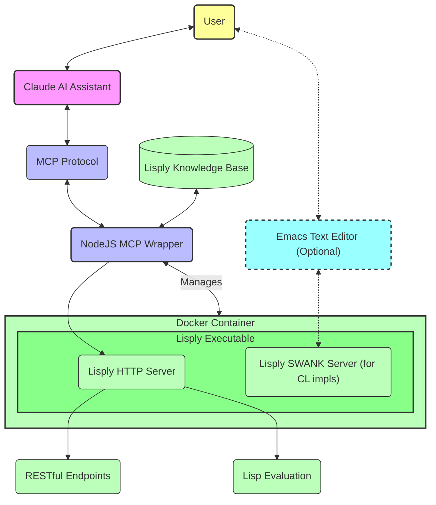

# Model Context Protocol (MCP) Wrapper for Lisply Backends

This MCP wrapper script connects Claude Desktop to Lisp backends, enabling direct AI-assisted symbolic programming with systems like [Gendl](https://gitlab.common-lisp.net/gendl/gendl).

## Quick Start

### 1. Install

```bash
cd scripts
npm install
chmod +x mcp-wrapper.js
```

### 2. Add to Claude Desktop Configuration

Add this to your `claude_desktop_config.json`:

```json
{
  "mcpServers": {
    "lisply": {
      "command": "node",
      "args": [
        "/path/to/lisply-mcp/scripts/mcp-wrapper.js"
      ]
    }
  }
}
```

With volume mounting (useful for project access):
```json
{
  "mcpServers": {
    "lisply": {
      "command": "node",
      "args": [
        "/path/to/lisply-mcp/scripts/mcp-wrapper.js",
        "--mount", "/home/user/projects:/projects"
      ]
    }
  }
}
```

### 3. Available Tools for Claude

The wrapper exposes these tools to Claude:

- `lisp_eval`: Evaluate Lisp code directly
- `http_request`: Make HTTP requests to backend endpoints
- `ping_lisp`: Check if the Lisp backend is available

### 4. Example Lisp Evaluation

Claude can now run Lisp code:

```lisp
(in-package :gdl-user)
(defparameter *box* (make-box :width 10 :height 5 :depth 3))
(theo *box* width) ;; Returns 10
```

## Table of Contents

- [Overview](#overview)
- [Architecture](#architecture)
- [Features](#features)
- [Detailed Installation](#detailed-installation)
- [Advanced Configuration](#advanced-configuration)
  - [Command-Line Arguments](#command-line-arguments)
  - [Environment Variables](#environment-variables)
- [Docker Integration](#docker-integration)
- [Communication Modes](#communication-modes)
- [Advanced Claude Desktop Configuration](#advanced-claude-desktop-configuration)
- [Real-World Examples](#real-world-examples)
- [Troubleshooting](#troubleshooting)
- [License](#license)

## Overview

The Lisply MCP wrapper is implemented in Nodejs with a modular architecture, and provides a bridge
between Claude AI and any [compliant Lisply backend
system](BACKEND-REQS.md). This wrapper enables Claude to:

1. Evaluate Lisp code in the Lisply Environment (LE).
2. Make HTTP requests to any endpoints implemented in the LE.
3. Access introspection and documentation lookup facilities in the LE.
4. Create, manipulate, compile, load, and analyze files through Lisp evaluation.
5. Interact with Lisp debuggers (for locally spawned containers).

## Architecture

The MCP wrapper implements the Model Context Protocol (MCP) to connect
Claude with Lisply backend capabilities. Here's how the components interact:




The wrapper script handles:
1. Starting and managing a Lisply Docker container if needed
2. Routing requests between Claude and the Lisply Backend
3. Translating between the MCP protocol and the backend [Lisply
   API](BACKEND-REQS.md)
4. Error handling and logging

### Modular Code Structure

The wrapper is organized into a modular structure for maintainability:

- **lib/config.js**: Configuration loading and environment handling
- **lib/logger.js**: Logging functionality 
- **lib/docker.js**: Docker container management
- **lib/server.js**: HTTP server and MCP wrapper implementation
- **lib/utils.js**: Utility functions for response handling
- **handlers/**: Tool-specific request handlers
  - **initialize.js**: Initialization handler
  - **toolsList.js**: Tools list handler
  - **toolCall.js**: Main tool call dispatcher
  - **httpRequest.js**: HTTP request handler
  - **ping.js**: Ping handler
  - **lispEval.js**: Lisp evaluation handler
- **mcp-wrapper.js**: Main entry point


## Features

- **Configurable Lisply Host & Port**: Configure via command-line arguments or environment variables
- **Docker Container Management**: Automatically start Lisply container when needed 
- **Volume Mounting**: Mount host directories into the Lisply container
- **Run Self in Docker**: Run this wrapper directly on host or inside a container with Docker socket
- **Error Handling**: Detection and reporting of errors
- **Detailed Logging**: Detailed logs with timestamps and optional debug mode for more verbosity
- **Automatic Docker Image Selection**: Sensible defaults based on cloned branch and selected backend type
- **DockerHub Authentication**: Auto-pulls latest container images with authentication handling
- **Existing Service Detection**: Relies on existing live services when available, avoiding the need to start & stop a dedicated container
- **Multiple Communication Modes**: Support for both HTTP and stdio communication with interactive debugging capabilities
- **Modular Code Structure**: Well-organized code with clear separation of concerns for maintainability

## Detailed Installation

1. Clone this repository:
```bash
git clone https://github.com/your-org/lisply-mcp.git
```

2. Install the required dependencies:
```bash
cd lisply-mcp/scripts
npm install
chmod +x mcp-wrapper.js
```

3. Ensure Docker is installed on your system.

4. Test the script:
```bash
node mcp-wrapper.js --help
```

## Advanced Configuration

The MCP wrapper is highly configurable through command-line arguments or environment variables.

### Command-Line Arguments

```bash
Options:
  -H, --backend-host <host>            Lisply server host (default: 127.0.0.1)
  --swank-host-port <port>             SWANK port on host system (external) (default: 4201)
  --http-host-port <port>              HTTP port on host system (external) (default: 9081)
  --https-host-port <port>             HTTPS port on host system (external) (default: 9444)
  --telnet-host-port <port>            TELNET port on host system (external) (default: 4024)
  --http-port <port>                   HTTP port inside container (internal) (default: 9080)
  --https-port <port>                  HTTPS port inside container (internal) (default: 9443)
  --swank-port <port>                  SWANK port inside container (internal) (default: 4200)
  --telnet-port <port>                 TELNET port inside container (internal) (default: 4023)
  --image-base-name <n>                Base name for Docker image (default: dcooper8/gendl)
  --image-branch <branch>              Branch to use for Docker image (default: auto-detected)
  --docker-image <image>               Full Docker image for backend (overrides base name and branch)
  --lisp-impl <impl>                   Lisp implementation to use, ccl or sbcl (default: ccl)
  --no-auto-start                      Do not auto-start backend docker container if not running
  --docker-socket <path>               Path to docker socket (default: /var/run/docker.sock)
  --log-file <path>                    Path to log file (default: /tmp/lisply-mcp-wrapper.log)
  --debug                              Enable debug logging
  --mount <mounts...>                  Mount volumes in format "src:dst" (can specify multiple times)
  --start-http                         Start HTTP service in backend container (default: true)
  --start-https                        Start HTTPS service in backend container (default: false)
  --start-swank                        Start SWANK service in backend container (default: true)
  --start-telnet                       Start TELNET service in backend container (default: false)
  --no-use-stdio                       Disable stdio capability for local containers
  --repl-prompt <pattern>              REPL prompt pattern to detect Lisp evaluation completion (default: ?)
  --eval-timeout <ms>                  Timeout for Lisp evaluation in milliseconds (default: 30000)
  --endpoint-prefix <prefix>           Prefix for all endpoints (default: lisply)
  --lisp-eval-endpoint <n>             Endpoint name for Lisp evaluation (default: lisp-eval)
  --http-request-endpoint <n>          Endpoint name for HTTP requests (default: http-request)
  --ping-endpoint <n>                  Endpoint name for ping (default: ping-lisp)
  -h, --help                           Display help for command
```

### Environment Variables

The script also supports configuration via environment variables. You can specify variables with the "LISPLY_" prefix or with no prefix:

**Note:** It's important to distinguish between host ports (visible on the host system) and container ports (internal to the container):

| Environment Variable | Description | Default |
|----------------------|-------------|---------|
| `BACKEND_HOST` or `LISPLY_BACKEND_HOST` | Lisply server host | 127.0.0.1 |
| `SWANK_HOST_PORT` or `LISPLY_SWANK_HOST_PORT` | SWANK port on host system (external) | 4201 |
| `HTTP_HOST_PORT` or `LISPLY_HTTP_HOST_PORT` | HTTP port on host system (external) | 9081 |
| `HTTPS_HOST_PORT` or `LISPLY_HTTPS_HOST_PORT` | HTTPS port on host system (external) | 9444 |
| `TELNET_HOST_PORT` or `LISPLY_TELNET_HOST_PORT` | TELNET port on host system (external) | 4024 |
| `HTTP_PORT` or `LISPLY_HTTP_PORT` | HTTP port inside container (internal) | 9080 |
| `HTTPS_PORT` or `LISPLY_HTTPS_PORT` | HTTPS port inside container (internal) | 9443 |
| `SWANK_PORT` or `LISPLY_SWANK_PORT` | SWANK port inside container (internal) | 4200 |
| `TELNET_PORT` or `LISPLY_TELNET_PORT` | TELNET port inside container (internal) | 4023 |
| `START_HTTP` or `LISPLY_START_HTTP` | Enable HTTP service | true |
| `START_HTTPS` or `LISPLY_START_HTTPS` | Enable HTTPS service | false |
| `START_SWANK` or `LISPLY_START_SWANK` | Enable SWANK service | true |
| `START_TELNET` or `LISPLY_START_TELNET` | Enable TELNET service | false |
| `DOCKER_IMAGE` or `LISPLY_DOCKER_IMAGE` | Docker image for backend | (auto-detected) |
| `IMAGE_BASE` or `LISPLY_IMAGE_BASE` | Base name for Docker image | dcooper8/gendl |
| `IMAGE_BRANCH` or `LISPLY_IMAGE_BRANCH` | Branch for Docker image | (auto-detected) |
| `LISP_IMPL` or `LISPLY_LISP_IMPL` | Lisp implementation to use | ccl |
| `AUTO_START` or `LISPLY_AUTO_START` | Enable auto-starting container | true |
| `DOCKER_SOCKET` or `LISPLY_DOCKER_SOCKET` | Path to Docker socket | /var/run/docker.sock |
| `LOG_FILE` or `LISPLY_LOG_FILE` | Path to log file | /tmp/lisply-mcp-wrapper.log |
| `DEBUG_MODE` or `LISPLY_DEBUG_MODE` | Enable debug logging | false |
| `MOUNTS` or `LISPLY_MOUNTS` | Comma-separated mount points | (none) |
| `USE_STDIO` or `LISPLY_USE_STDIO` | Enable stdio capability | true |
| `REPL_PROMPT` or `LISPLY_REPL_PROMPT` | REPL prompt pattern | ? (depends on implementation) |
| `EVAL_TIMEOUT` or `LISPLY_EVAL_TIMEOUT` | Timeout for Lisp evaluation in ms | 30000 |
| `ENDPOINT_PREFIX` or `LISPLY_ENDPOINT_PREFIX` | Prefix for all endpoints | lisply |
| `LISP_EVAL_ENDPOINT` or `LISPLY_LISP_EVAL_ENDPOINT` | Endpoint name for Lisp evaluation | lisp-eval |
| `HTTP_REQUEST_ENDPOINT` or `LISPLY_HTTP_REQUEST_ENDPOINT` | Endpoint name for HTTP requests | http-request |
| `PING_ENDPOINT` or `LISPLY_PING_ENDPOINT` | Endpoint name for ping | ping-lisp |

## Docker Integration

The MCP wrapper integrates closely with Docker to manage Lisply containers efficiently.

### Docker Image Selection

The wrapper automatically selects the appropriate Docker image based on the current branch in your lisply-mcp repository:

1. The Docker image follows the naming pattern: `dcooper8/gendl:${branch}-${impl}`
   - `${branch}` is the current git branch name with any slashes (`/`) converted to double hyphens (`--`)
     - For example, `release/1598` becomes `release--1598` in the image tag
     - `devo` branch will use the image tag `devo`
   - `${impl}` is the Lisp implementation (ccl or sbcl)

2. The script will attempt to pull or use an image matching your current branch:
   - First tries to pull the image matching your current branch from Docker Hub
   - If pull fails, checks if the image exists locally
   - If neither works, falls back to the `master` branch image

3. You can override the automatic selection with:
   - The `--docker-image` command-line argument
   - The `--image-base-name` and `--image-branch` arguments
   - The `LISPLY_DOCKER_IMAGE` environment variable
   - The `LISPLY_IMAGE_BASE` and `LISPLY_IMAGE_BRANCH` environment variables

4. For the Lisp implementation:
   - Specify with `--lisp-impl` (ccl or sbcl)
   - Or use the `LISPLY_LISP_IMPL` environment variable
   - Defaults to ccl if not specified

### Docker Hub Authentication

The wrapper will attempt to pull the latest version of the appropriate Docker image before starting a container. This behavior includes:

1. Checking for Docker Hub authentication
2. Attempting to log in if not authenticated (using stored credentials or interactive login)
3. Pulling the latest image matching your configuration
4. Falling back to using a local image if pull fails
5. Attempting to pull the default image (master-ccl) as a last resort if needed

### Existing Service Detection

The wrapper will check if a Lisply service is already running on the specified host and ports before attempting to start a container:

1. HTTP service (HTTP_HOST_PORT) is checked first as the primary service
2. SWANK service (SWANK_HOST_PORT) is checked as a fallback

#### Parameter Behavior with Existing Services

**Important:** When an existing service is detected on the specified host and port:

1. All Docker-related settings will be ignored:
   - `--docker-image`, `--image-base-name`, `--image-branch`, and `--lisp-impl`
   - `--mount` volume options
   - `--start-*` service flags
   - `--*-port` internal container port settings
   - `--docker-socket` path
   - `--no-auto-start` flag

2. The wrapper will display warnings about which settings are being ignored

This ensures the wrapper works properly with external Lisply services while giving clear feedback about ignored configuration options.

### Volume Mounting

You can mount host directories into the Lisply container to share files between your host system and the container:

```bash
node mcp-wrapper.js --mount /home/user/projects:/projects
```

Multiple mount points can be specified:
```bash
node mcp-wrapper.js --mount /home/user/projects:/projects --mount /home/user/data:/data
```

Or using environment variables:
```bash
LISPLY_MOUNTS=/home/user/projects:/projects,/home/user/data:/data node mcp-wrapper.js
```

## Communication Modes

The Lisply MCP wrapper supports two primary modes of communication with the Lisply backend: HTTP mode and stdio mode.

### HTTP Mode

HTTP mode is the default communication method and works with both local and remote Lisply backends.

**Characteristics:**
- Structured responses with separate result and stdout fields
- Error handling that captures and returns errors as strings
- Compatible with all Lisply backends, local or remote
- Suitable for most use cases
- Response format: `Result: <result>, Stdout: <output>`

**Example response in HTTP mode:**
```
Result: 6, Stdout: This is a message to standard output
```

### Stdio Mode

Stdio mode provides a direct REPL experience for local containers and supports interactive debugging capabilities.

**Characteristics:**
- Raw REPL-like output without structured formatting
- Support for interactive debugger when errors occur
- Only available for local containers started by the MCP wrapper
- Ideal for development, debugging, and complex interactions
- Preserves exactly what the REPL outputs

**Example response in stdio mode:**
```
This is a message to standard output
6
```

**Debugger Support:**
When an error occurs in stdio mode, the Lisp debugger can be activated, allowing Claude to interact with it. The wrapper detects debugger prompts and provides metadata about the debugger state to Claude.

**Mode Selection:**
- Default mode is HTTP
- To use stdio mode, specify `mode: "stdio"` in the `lisp_eval` tool parameters
- Stdio capability can be disabled with the `--no-use-stdio` flag or `LISPLY_USE_STDIO=false`
- If stdio mode is requested but not available, the wrapper will fall back to HTTP mode

## Usage Examples 

All the below examples can be tested on command line and used in
`claude_desktop_config.json` configuration (see [Claude Desktop Configuration](#claude-desktop-configuration)).

### Basic Usage

Run with default settings (localhost:9081):
```bash
node mcp-wrapper.js
```

### Custom Host and Port

Specify a custom Lisply server:
```bash
node mcp-wrapper.js --backend-host 192.168.1.100 --swank-host-port 4201 --http-host-port 9081
```

### Custom Lisp Implementation

Specify a different Lisp implementation:
```bash
node mcp-wrapper.js --lisp-impl sbcl
```

### Enabling Services

Enable HTTP and HTTPS services:
```bash
node mcp-wrapper.js --start-http --start-https
```

Or using environment variables:
```bash
LISPLY_START_HTTP=true LISPLY_START_HTTPS=true node mcp-wrapper.js
```

### Configuring Internal Container Ports

Specify all internal ports:
```bash
node mcp-wrapper.js --http-port 9080 --https-port 9443 --swank-port 4200 --telnet-port 4023
```

Or using environment variables:
```bash
LISPLY_HTTP_PORT=9080 LISPLY_HTTPS_PORT=9443 LISPLY_SWANK_PORT=4200 LISPLY_TELNET_PORT=4023 node mcp-wrapper.js
```

### Customizing Endpoints

Customize the endpoint prefix and names:
```bash
node mcp-wrapper.js --endpoint-prefix mylisp --lisp-eval-endpoint evaluate --ping-endpoint health-check
```

### Running in a Container

If running the wrapper inside a container, make sure to mount the Docker socket:
```bash
docker run -v /var/run/docker.sock:/var/run/docker.sock -v /path/to/scripts:/app node:18 node /app/mcp-wrapper.js
```

## Advanced Claude Desktop Configuration

Here's a more advanced example of how to configure Claude Desktop to use this wrapper:

```json
{
  "mcpServers": {
    "filesystem": {
      "command": "wsl",
      "args": [
        "docker",
        "run",
        "-i",
        "--rm",
        "-u",
        "1000:1000",
        "--mount",
        "type=bind,src=/home/user/projects,dst=/projects",
        "mcp/filesystem",
        "/projects"
      ]
    },
    "lisply": {
      "command": "wsl",
      "args": [
        "node",
        "/home/user/projects/lisply-mcp/scripts/mcp-wrapper.js",
        "--mount", "/home/user/projects:/projects",
        "--debug",
        "--start-https"
      ],
      "env": {
        "NODE_ENV": "production",
        "DEBUG": "*"
      }
    }
  },
  "globalShortcut": ""
}
```

### Tool Details for Claude

#### Lisp Evaluation Tool (`lisp_eval`)

The `lisp_eval` tool allows Claude to evaluate Lisp code directly within the Lisply environment with these parameters:

- `code` (required): The Lisp code to evaluate
- `package` (optional): The package to use for the evaluation
- `mode` (optional): The mode to use to talk to Lisply
  - `http` (default): Uses HTTP communication for structured responses
  - `stdio`: Uses standard input/output communication for a raw REPL experience

**Mode Comparison:**

| Feature | HTTP Mode | STDIO Mode |
|---------|-----------|------------|
| Response Format | Structured with separate Result and Stdout fields | Raw REPL-like output |
| Error Handling | Traps errors and returns them as strings | Can enter interactive debugger |
| Debugger Support | No interactive debugging | Supports interactive debugger |
| Compatibility | Works with local & remote servers | Only for local containers started by MCP |
| Use Case | Clean integration, simple queries | Development, debugging, complex interactions |

Example usage with STDIO mode (for debugging):
```lisp
;; This will allow interactive debugging if errors occur
(in-package :gdl-user)
(defparameter *test-box* (make-box :width 10 :height 5 :depth 3))
(theo *test-box* width)
```

#### HTTP Request Tool (`http_request`)

The `http_request` tool enables Claude to interact with any HTTP endpoint exposed by Lisply:

```json
{
  "path": "/color-map",
  "method": "GET",
  "headers": {
    "Accept": "application/json"
  }
}
```

#### Ping Tool (`ping_lisp`)

The `ping_lisp` tool lets Claude check if the Lisply server is available:

```
ping_lisp()
```

## Real-World Examples

### Example 1: Creating a Parametric Box

In this example, Claude creates a parametric box in the Lisply environment and then modifies its properties based on user requirements.

**User**: "Can you create a box with width 10, height 5, and depth 3? Then show me how to change the height to 8."

**Claude**:

I'll create a parametric box using the lisp_eval tool, then show you how to modify its height.

First, let's create the box with the specified dimensions:

```lisp
(in-package :gdl-user)

;; First, create a box with the specified dimensions
(defparameter *my-box* (make-object 'box 
                         :width 10 
                         :height 5 
                         :depth 3))

;; Let's verify the dimensions
(list (theo *my-box* width)
      (theo *my-box* height)
      (theo *my-box* depth))
```

Now, let's change the height from 5 to 8:

```lisp
;; Change the height using setf with accessor
(theo *my-box* (set-slot! :height 8))

;; Alternatively, we could create a new box
(defparameter *new-box* (make-object 'box 
                         :width 10 
                         :height 8  ;; Updated height
                         :depth 3))

;; Verify the new dimensions of original box
(list (theo *my-box* width)
      (theo *my-box* height)
      (theo *my-box* depth))
```

You can visualize this box by creating a web interface or using
built-in visualization tools.

Would you like me to show you how to create a more complex parametric
object or how to set up visualization?

### Example 2: Demonstrating the Difference Between HTTP and Stdio Modes

**User**: "Can you show me the difference between HTTP and stdio modes by evaluating a simple expression that prints something and returns a value?"

**Claude**:

I'll demonstrate the difference between HTTP and stdio modes by evaluating a simple Lisp expression that both prints output and returns a value.

First, let's use HTTP mode (the default):

```lisp
(progn 
  (format t "This is a message to standard output~%") 
  (+ 1 2 3))
```

Response in HTTP mode:
```
Result: 6, Stdout: This is a message to standard output
```

Now, let's use stdio mode for the same expression:

```lisp
;; Using mode: stdio
(progn 
  (format t "This is a message to standard output~%") 
  (+ 1 2 3))
```

Response in stdio mode:
```
This is a message to standard output
6
```

Notice the difference: HTTP mode provides a structured response with labeled Result and Stdout sections, while stdio mode gives you the raw REPL output exactly as it appears in the Lisp REPL.

Stdio mode is particularly useful for debugging because it can show you interactive debugger prompts. For example, if we introduce an error:

```lisp
;; Using mode: stdio
(progn
  (format t "About to generate an error~%")
  (/ 1 0))
```

In stdio mode, you might see something like:
```
About to generate an error
> Error: Division by zero
> While executing: /
> Type :help for debugging options
```

This allows Claude to interact with the debugger directly. In HTTP mode, you would just get an error message without the interactive capabilities.

## Troubleshooting

### Common Issues and Solutions

#### Container Won't Start

If the Lisply container fails to start:

1. Check if Docker is running:
```bash
docker info
```

2. Check if the ports are already in use:
```bash
sudo lsof -i :4201
sudo lsof -i :9081
```

3. Verify that the Docker image exists:
```bash
docker images | grep gendl
```

4. Try pulling the image manually:
```bash
docker pull dcooper8/gendl:master-ccl
```

#### Connection Errors

If Claude can't connect to Lisply:

1. Check if the Lisply server is running:
```bash
docker ps | grep lisply
```

2. Enable debug logging:
```bash
node mcp-wrapper.js --debug
```

3. Check the log file:
```bash
tail -f /tmp/lisply-mcp-wrapper.log
```

4. Try pinging the Lisply HTTP server:
```bash
curl http://localhost:9081/lisply/ping-lisp
```

5. Try connecting to the Lisply SWANK server:
```bash
telnet localhost 4201
```

#### Permission Issues

If you encounter permission errors:

1. Check Docker socket permissions:
```bash
ls -l /var/run/docker.sock
```

2. Make sure your user has permission to access Docker:
```bash
sudo usermod -aG docker $USER
```

3. Check mounted directory permissions:
```bash
ls -l /path/to/mounted/directory
```

### Diagnostic Commands

Use these commands to diagnose issues:

1. Check wrapper logs:
```bash
tail -f /tmp/lisply-mcp-wrapper.log
```

2. Check Docker container logs:
```bash
docker logs $(docker ps --filter "name=lisply-mcp" --format "{{.ID}}")
```

3. Check Lisply service status:
```bash
curl http://localhost:9081/lisply/ping-lisp
```

4. Verify Docker environment:
```bash
docker system info
```

## License

This software is licensed under the GNU Affero General Public License v3.0 (AGPL-3.0), the same license used by Gendl.

### License Implications

**Important Note**: Simply using this MCP server to interact with Gendl and obtain outputs does not trigger the requirements of the AGPL. You can use this wrapper to interact with Gendl without being required to share your code.

However, if you modify this wrapper and host a service based on the modified software, the AGPL would require you to share your modifications with the users of that service. In other words, if you run a modified version of this software as a network service, you must make the modified source code available to the users of that service.

For applications that need to keep their source code closed, Genworks offers an "AGPL escape clause" in the form of a 5% self-reported quarterly royalty. More information and a payment gateway are available at [payments.genworks.com](https://payments.genworks.com).

The full text of the license can be found in the COPYING.txt file in this directory.
