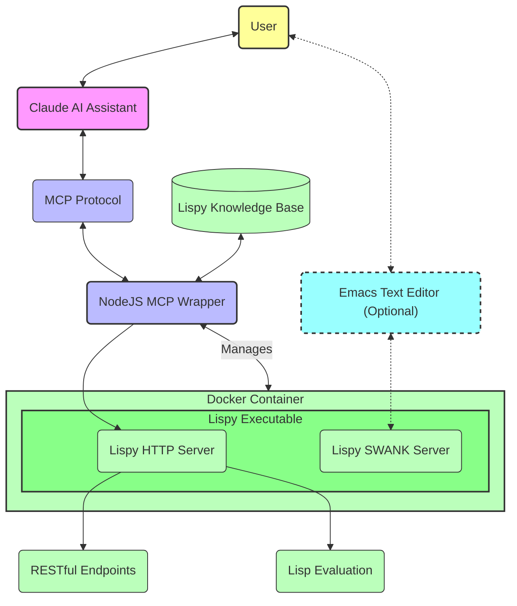

# Model Context Protocol (MCP) Wrapper for Lisply Backends

This is an MCP wrapper script meant for connecting Claude Desktop and
similar "agentic AI clients" to Lisp-speaking backend services. It
provides a powerful interface between Claude and any
[compliant](BACKEND-REQS.md) Lisp-speaking backend service
e.g. [Gendl](https://gitlab.common-lisp.net/gendl/gendl), enabling
direct AI-assisted symbolic programming.

**NOTE:** this implementation currently works with the
[Gendl](https://gitlab.common-lisp.net/gendl/gendl) system,
automatically starting and stopping a Gendl container if needed. Work
is underway to generalize the implementation to support a [Gnu Emacs
Backend](https://github.com/gornskew/skewed-emacs.git), and subsequently
we welcome more [compliant](BACKEND-REQS.md) Lispy systems.

## Table of Contents

- [Overview](#overview)
- [Architecture](#architecture)
- [Features](#features)
- [Installation](#installation)
- [Configuration](#configuration)
  - [Command-Line Arguments](#command-line-arguments)
  - [Environment Variables](#environment-variables)
- [Docker Integration](#docker-integration)
  - [Docker Image Selection](#docker-image-selection)
  - [Docker Hub Authentication](#docker-hub-authentication)
  - [Existing Service Detection](#existing-service-detection)
  - [Volume Mounting](#volume-mounting)
- [Usage Examples](#usage-examples)
- [Claude Integration](#claude-integration)
  - [Tools for Claude](#tools-for-claude)
  - [Claude Desktop Configuration](#claude-desktop-configuration)
- [Real-World Examples](#real-world-examples)
- [Troubleshooting](#troubleshooting)
- [License](#license)

## Overview

The Lisply MCP wrapper is implemented in Nodejs, and provides a bridge
between Claude AI and any [compliant Lisply backend
system](BACKEND-REQS.md). This wrapper enables Claude to:

1. Evaluate Lisp code in the Lisply Environment (LE).
2. Make HTTP requests any endpoints implemented in the LE.
3. Access any Introspection and Documentation lookup facilities in the LE.
4. Create, manipulate, compile, load, analyze files through Lisp evaluation. 
5. Interact with Lisp debuggers (for locally spawned containers). 

## Architecture

The MCP wrapper implements the Model Context Protocol (MCP) to connect
Claude with Gendl's capabilities. Here's how the components interact:




The wrapper script handles:
1. Starting and managing a Lispy Docker container if needed
2. Routing requests between Claude and the Lispy Backend
3. Translating between the MCP protocol and the backend [Lispy
   API](BACKEND.md)
4. Error handling and logging


## Features

- **Configurable Lispy Host & Port**: Configure via command-line arguments or environment variables
- **Docker Container Management**: Automatically start Lispy container when needed 
- **Volume Mounting**: Mount host directories into the Lispy container
- **Run Self in Docker**: Run this wrapper directly on host or inside a container with Docker socket
- **Error Handling**: Detection and reporting of errors
- **Detailed Logging**: Detailed logs with timestamps and optional debug mode for more verbosity
- **Automatic Docker Image Selection**: Sensible defaults based on cloned branch and selected backend type
- **DockerHub Authentication**: Auto-pulls latest container images with authentication handling
- **Existing Service Detection**: Relies on existing live services when available, avoiding the need to start & stop a dedicated container 

## Installation

1. Install the required dependencies:
```bash
cd /path/to/lispy-mcp/scripts
npm install
chmod +x mcp-wrapper.js
```

2. Ensure Docker is installed on your system.

3. Test the script:
```bash
node mcp-wrapper.js --help
```

## Configuration

You can configure the MCP wrapper using either command-line arguments
or environment variables.

### Command-Line Arguments

```bash
Options:
  -H, --host <host>            Lispy server host (default: 127.0.0.1)
  --swank-host-port <port>     SWANK port on host system (default: 4201)
  --http-host-port <port>      HTTP port on host system (default: 9081)
  --https-host-port <port>     HTTPS port on host system (default: 9444)
  --telnet-host-port <port>    TELNET port on host system (default: 4024)
  --http-port <port>           HTTP port inside container (default: 9080)
  --https-port <port>          HTTPS port inside container (default: 9443)
  --swank-port <port>          SWANK port inside container (default: 4200)
  --telnet-port <port>         TELNET port inside container (default: 4023)
  --docker-image <image>       Docker image for Lispy services (default: `dcooper8/gendl:<branch>-<lisp-impl>`)
  --lisp-impl <impl>           Lisp implementation to use, e.g. ccl or sbcl for `dcooper8/gendl` (default: ccl)
  --no-auto-start              Do not auto-start Gendl docker container if live service not available (resulting in an error exit).
  --docker-socket <path>       Path to docker socket (needed if running this nodejs wrapper inside a docker container) (default: /var/run/docker.sock)
  --log-file <path>            Path to log file of this script (default: /tmp/mcp-wrapper.log)
  --debug                      Enable debug logging (more verbose)
  --mount <mounts...>          Mount volumes in format "src:dst" (can specify multiple times)
  --start-http                 Start HTTP service in Gendl container (required)(default: true)
  --start-https                Start HTTPS service in Gendl container (default: false)
  --start-swank                Start SWANK service in Gendl container (default: true)
  --start-telnet               Start TELNET service in Gendl container (default: false)
  -h, --help                   Display help for command
```

### Environment Variables

The script also supports configuration via environment variables:

| Environment Variable | Description | Default |
|----------------------|-------------|---------|
| `GENDL_HOST` | Gendl server host | 127.0.0.1 |
| `SWANK_HOST_PORT` | SWANK port on host system | 5200 |
| `HTTP_HOST_PORT` | HTTP port on host system | 10080 |
| `HTTPS_HOST_PORT` | HTTPS port on host system | 10443 |
| `TELNET_HOST_PORT` | TELNET port on host system | 5023 |
| `HTTP_PORT` | HTTP port inside container | 9080 |
| `HTTPS_PORT` | HTTPS port inside container | 9443 |
| `SWANK_PORT` | SWANK port inside container | 4200 |
| `TELNET_PORT` | TELNET port inside container | 4023 |
| `START_HTTP` | Enable HTTP service | true |
| `START_HTTPS` | Enable HTTPS service | false |
| `START_SWANK` | Enable SWANK service | true |
| `START_TELNET` | Enable TELNET service | false |
| `GENDL_DOCKER_IMAGE` | Docker image for Gendl | (auto-detected) |
| `GENDL_LISP_IMPL` | Lisp implementation to use | ccl |
| `GENDL_AUTO_START` | Enable auto-starting container | true |
| `DOCKER_SOCKET` | Path to Docker socket | /var/run/docker.sock |
| `GENDL_LOG_FILE` | Path to log file | /tmp/mcp-wrapper.log |
| `DEBUG_GENDL` | Enable debug logging | false |
| `GENDL_MOUNTS` | Comma-separated mount points | (none) |

## Docker Integration

The MCP wrapper integrates closely with Docker to manage Gendl containers efficiently.

### Docker Image Selection

The wrapper automatically selects the appropriate Docker image based on the current branch in your lispy-mcp repository:

1. The Docker image follows the naming pattern: `dcooper8/gendl:${branch}-${impl}`
   - `${branch}` is the current git branch name with any slashes (`/`) converted to double hyphens (`--`)
     - For example, `release/1598` becomes `release--1598` in the image tag
     - `devo` branch will use the image tag `devo`
   - `${impl}` is the Lisp implementation (ccl or sbcl)

2. The script will attempt to pull or use an image matching your current branch:
   - First tries to pull the image matching your current branch from Docker Hub
   - If pull fails, checks if the image exists locally
   - If neither works, falls back to the `master` branch image

3. You can override the automatic selection with:
   - The `--docker-image` command-line argument
   - The `GENDL_DOCKER_IMAGE` environment variable

4. For the Lisp implementation:
   - Specify with `--lisp-impl` (ccl or sbcl)
   - Or use the `GENDL_LISP_IMPL` environment variable
   - Defaults to ccl if not specified

### Docker Hub Authentication

The wrapper will attempt to pull the latest version of the appropriate Docker image before starting a container. This behavior includes:

1. Checking for Docker Hub authentication
2. Attempting to log in if not authenticated (using stored credentials or interactive login)
3. Pulling the latest image matching your configuration
4. Falling back to using a local image if pull fails
5. Attempting to pull the default image (master-ccl) as a last resort if needed

### Existing Service Detection

The wrapper will check if a Gendl service is already running on the specified host and ports before attempting to start a container:

1. HTTP service (HTTP_HOST_PORT) is checked first as the primary service
2. SWANK service (SWANK_HOST_PORT) is checked as a fallback

#### Parameter Behavior with Existing Services

**Important:** When an existing service is detected on the specified host and port:

1. All Docker-related settings will be ignored:
   - `--docker-image` and `--lisp-impl`
   - `--mount` volume options
   - `--start-*` service flags
   - `--*-port` internal container port settings
   - `--docker-socket` path
   - `--no-auto-start` flag

2. The wrapper will display warnings about which settings are being ignored

This ensures the wrapper works properly with external Gendl services while giving clear feedback about ignored configuration options.

### Volume Mounting

You can mount host directories into the Gendl container to share files between your host system and the container:

```bash
node mcp-wrapper.js --mount /home/user/projects:/projects
```

Multiple mount points can be specified:
```bash
node mcp-wrapper.js --mount /home/user/projects:/projects --mount /home/user/data:/data
```

Or using environment variables:
```bash
GENDL_MOUNTS=/home/user/projects:/projects,/home/user/data:/data node mcp-wrapper.js
```

## Usage Examples 

All the below examples can be tested on command line and used in
`claude_desktop_config.json` configuration (see [Claude Desktop Configuration](#claude-desktop-configuration)).

### Basic Usage

Run with default settings (localhost:5200):
```bash
node mcp-wrapper.js
```

### Custom Host and Port

Specify a custom Gendl server:
```bash
node mcp-wrapper.js --host 192.168.1.100 --swank-host-port 5200 --http-host-port 10080
```

### Custom Lisp Implementation

Specify a different Lisp implementation:
```bash
node mcp-wrapper.js --lisp-impl sbcl
```

### Enabling Services

Enable HTTP and HTTPS services:
```bash
node mcp-wrapper.js --start-http --start-https
```

Or using environment variables:
```bash
START_HTTP=true START_HTTPS=true node mcp-wrapper.js
```

### Configuring Internal Container Ports

Specify all internal ports:
```bash
node mcp-wrapper.js --http-port 9080 --https-port 9443 --swank-port 4200 --telnet-port 4023
```

Or using environment variables:
```bash
HTTP_PORT=9080 HTTPS_PORT=9443 SWANK_PORT=4200 TELNET_PORT=4023 node mcp-wrapper.js
```

### Running in a Container

If running the wrapper inside a container, make sure to mount the Docker socket:
```bash
docker run -v /var/run/docker.sock:/var/run/docker.sock -v /path/to/scripts:/app node:18 node /app/mcp-wrapper.js
```

## Claude Integration

This wrapper enables Claude to interact with Gendl through the Model Context Protocol (MCP).

### Tools for Claude

The MCP wrapper exposes several tools that Claude can use to interact with Gendl:

#### Lisp Evaluation Tool

The `lisp_eval` tool allows Claude to evaluate Lisp code directly within the Gendl environment. This enables Claude to:

- Create and manipulate GDL objects
- Perform complex calculations using Gendl's geometric primitives
- Access and modify Gendl's state

The tool accepts the following parameters:

- `code` (required): The Lisp code to evaluate
- `package` (optional): The package to use for the evaluation
- `mode` (optional): The mode to use to talk to Gendl
  - `http` (default): Uses HTTP communication for structured responses
  - `stdio`: Uses standard input/output communication for a raw REPL experience

**Mode Comparison:**

| Feature | HTTP Mode | STDIO Mode |
|---------|-----------|------------|
| Response Format | Structured with separate Result and Stdout fields | Raw REPL-like output |
| Error Handling | Traps errors and returns them as strings | Can enter interactive debugger |
| Debugger Support | No interactive debugging | Supports interactive debugger |
| Compatibility | Works with local & remote servers | Only for local containers started by MCP |
| Use Case | Clean integration, simple queries | Development, debugging, complex interactions |

Example usage with default HTTP mode:
```lisp
(in-package :gdl-user)
(defparameter *test-box* (make-box :width 10 :height 5 :depth 3))
(theo *test-box* width)
```

Example usage with STDIO mode (for debugging):
```lisp
;; This will allow interactive debugging if errors occur
(in-package :gdl-user)
(defparameter *test-box* (make-box :width 10 :height 5 :depth 3))
(theo *test-box* width)
```

#### HTTP Request Tool

The `http_request` tool enables Claude to interact with any HTTP endpoint exposed by Gendl:

```json
{
  "path": "/color-map",
  "method": "GET",
  "headers": {
    "Accept": "application/json"
  }
}
```

#### Knowledge Base Integration

The `query_gendl_kb` tool allows Claude to search for information about Gendl/GDL (General-purpose Declarative Language):

```
query_gendl_kb("How do I create a box in GDL?")
```

#### Ping Tool

The `ping_gendl` tool lets Claude check if the Gendl server is available:

```
ping_gendl()
```

### Claude Desktop Configuration

Here's an example of how to configure Claude Desktop to use this wrapper:

```json
{
  "mcpServers": {
    "filesystem": {
      "command": "wsl",
      "args": [
        "docker",
        "run",
        "-i",
        "--rm",
        "-u",
        "1000:1000",
        "--mount",
        "type=bind,src=/home/user/projects,dst=/projects",
        "mcp/filesystem",
        "/projects"
      ]
    },
    "gendl": {
      "command": "wsl",
      "args": [
        "node",
        "/home/user/projects/lispy-mcp/scripts/mcp-wrapper.js",
        "--mount", "/home/user/projects:/projects"
      ],
      "env": {
        "NODE_ENV": "production",
        "DEBUG": "*"
      }
    }
  },
  "globalShortcut": ""
}
```

## Real-World Examples

### Example 1: Creating a Parametric Box

In this example, Claude creates a parametric box in Gendl and then modifies its properties based on user requirements.

**User**: "Can you create a box in Gendl with width 10, height 5, and depth 3? Then show me how to change the height to 8."

**Claude**:

I'll create a parametric box in Gendl using the lisp_eval tool, then show you how to modify its height.

First, let's create the box with the specified dimensions:

```lisp
(in-package :gdl-user)

;; First, create a box with the specified dimensions
(defparameter *my-box* (make-object 'box 
                         :width 10 
                         :height 5 
                         :depth 3))

;; Let's verify the dimensions
(list (theo *my-box* width)
      (theo *my-box* height)
      (theo *my-box* depth))
```

Now, let's change the height from 5 to 8:

```lisp
;; Change the height using setf with accessor
(theo *my-box* (set-slot! :height 8))

;; Alternatively, we could create a new box
(defparameter *new-box* (make-object 'box 
                         :width 10 
                         :height 8  ;; Updated height
                         :depth 3))

;; Verify the new dimensions of original box
(list (theo *my-box* width)
      (theo *my-box* height)
      (theo *my-box* depth))
```

You can visualize this box by creating a GWL web interface or using
Gendl's built-in visualization tools.

Would you like me to show you how to create a more complex parametric
object or how to set up visualization?

### Example 2: Querying the Knowledge Base for GDL Information

**User**: "How do I create a cylinder in GDL and what parameters does
it accept?"

**Claude**:

I'll use the Gendl knowledge base to find information about creating
cylinders in GDL:

The basic syntax for creating a cylinder in GDL is:

```lisp
(make-object 'cylinder :radius 5 :height 8)
```

The main parameters for cylinders are:
- `:radius` - The radius of the cylinder (default is 1)
- `:height` - The height of the cylinder (default is 1)
- `:orientation` - The orientation matrix normally created with `alignment`
- `:center` - The center point (default is (make-point 0 0 0))

Here's a complete example:

```lisp
(in-package :gdl-user)

(defparameter *my-cylinder* (make-object 'cylinder 
                              :radius 2.5
                              :height 10
                              :orientation 
							  (alignment :rear (the (face-normal-vector :top)))))

;; Verify the parameters
(list (theo *my-cylinder* radius)
      (theo *my-cylinder* height)
      (theo *my-cylinder* center))
```

Note that the `:display-controls` is a plist of display properties
e.g. `:color` for rendering


Would you like me to explain any other aspects of working with cylinders in GDL?

## Troubleshooting

### Common Issues and Solutions

#### Container Won't Start

If the Gendl container fails to start:

1. Check if Docker is running:
```bash
docker info
```

2. Check if the ports are already in use:
```bash
sudo lsof -i :5200
sudo lsof -i :10080
```

3. Verify that the Docker image exists:
```bash
docker images | grep gendl
```

4. Try pulling the image manually:
```bash
docker pull dcooper8/gendl:master-ccl
```

#### Connection Errors

If Claude can't connect to Gendl:

1. Check if the Gendl server is running:
```bash
docker ps | grep gendl
```

2. Enable debug logging:
```bash
node mcp-wrapper.js --debug
```

3. Check the log file:
```bash
tail -f /tmp/mcp-wrapper.log
```

4. Try pinging the Gendl HTTP server:
```bash
curl http://localhost:10080/mcp/ping-gendl
```

5. Try connecting to the Gendl SWANK server:
```bash
telnet localhost 5200
```

#### Permission Issues

If you encounter permission errors:

1. Check Docker socket permissions:
```bash
ls -l /var/run/docker.sock
```

2. Make sure your user has permission to access Docker:
```bash
sudo usermod -aG docker $USER
```

3. Check mounted directory permissions:
```bash
ls -l /path/to/mounted/directory
```

### Diagnostic Commands

Use these commands to diagnose issues:

1. Check wrapper logs:
```bash
tail -f /tmp/mcp-wrapper.log
```

2. Check Docker container logs:
```bash
docker logs $(docker ps --filter "name=lispy-mcp" --format "{{.ID}}")
```

3. Check Gendl service status:
```bash
curl http://localhost:10080/mcp/ping-gendl
```

4. Verify Docker environment:
```bash
docker system info
```

## License

This software is licensed under the GNU Affero General Public License v3.0 (AGPL-3.0), the same license used by Gendl.

### License Implications

**Important Note**: Simply using this MCP server to interact with Gendl and obtain outputs does not trigger the requirements of the AGPL. You can use this wrapper to interact with Gendl without being required to share your code.

However, if you modify this wrapper and host a service based on the modified software, the AGPL would require you to share your modifications with the users of that service. In other words, if you run a modified version of this software as a network service, you must make the modified source code available to the users of that service.

For applications that need to keep their source code closed, Genworks offers an "AGPL escape clause" in the form of a 5% self-reported quarterly royalty. More information and a payment gateway are available at [payments.genworks.com](https://payments.genworks.com).

The full text of the license can be found in the COPYING.txt file in this directory.

