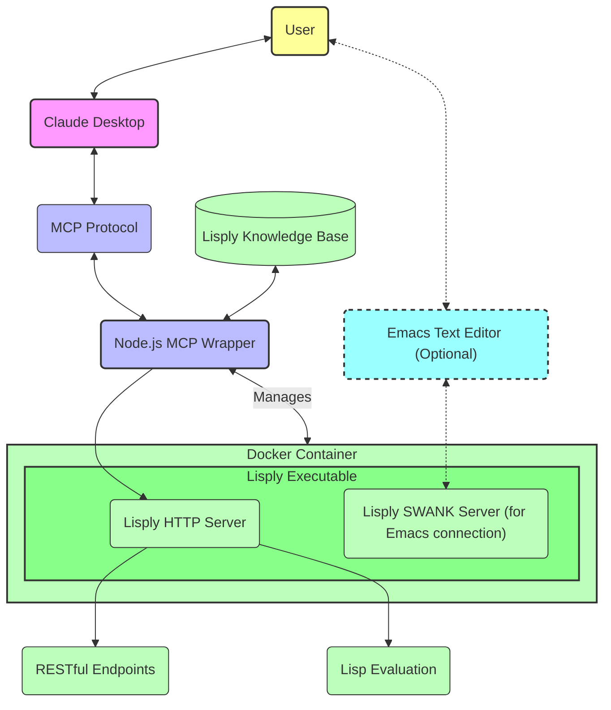

# Model Context Protocol (MCP) Middleware for Lisp-based and Lisp-like Environments


This project is a [Model Context Protocol
(MCP)](https://modelcontextprotocol.org) middleware that enables
[Large Language Models
(LLMs)](https://en.wikipedia.org/wiki/Large_language_model) to
interact with [Lisp-based](https://common-lisp.net/) development and
runtime environments using a lightweight protocol called _Lisply_.


## Who Is this Meant For?

 - AI practitioners curious about Lisp
 - Lisp practitioners curious about AI
 - Anyone interested in Neuro-Symbolic Programming
 - Mechanical/Civil Engineers and Designers interested in CAD
   Automation and Knowledge Based Engineering
 - Tinkerers, meddlers, and tamperers from all walks of life

## What Is it Meant to Do?

The Lisply-MCP middleware connects
[MCP-capable](https://modelcontextprotocol.org) AI Agent programs, or
_MCP Clients_, such as
[ClaudeDesktop](https://www.anthropic.com/claude), to Lisp-based
systems which support a REPL, or Read-Eval-Print Loop. The connection
is meant to facilitate AI-assisted symbolic programming sometimes
referred to as _Neuro-Symbolic Programming_. We have coined the term
"Lisply" to refer to a lightweight protocol which most any Lisp-like
system can implement to render it compatible with this Lisply-MCP
middleware.

The idea is that the LLM will be able to generate and evaluate
arbitrary Lisp expressions, including creating, compiling, loading,
and testing entire files and projects.


## Quick Start

The following will get you up and running quickly with a minimal
default configuration and a default public Common Lisp based backend
running as a Docker container. See the main Contents below for more
background and detailed configuration options.

### 1. Install

1. Install Node.js (18+ recommended). If on Windows, this can be
   installed directly in Windows or in WSL.

2. Install [Docker](https://docs.docker.com/engine/install/) (20+
    recommended) on the same host as where the Node.js is installed.

3. Clone this `lisply-mcp` repository to a location where your
   MCP-capable AI Agent (e.g. Claude Desktop) can access it.
   
 
### 2. Configure your MCP-capabile AI Agent

Edit or create your AI Agent's configuration file as shown below. In
the case of Claude Desktop, the configuration file is typically:


```
/mnt/c/Users/<user>/AppData/Roaming/Claude/claude_desktop_config.json
```

or 

```
c:\Users\<user>\AppData\Roaming\Claude\claude_desktop_config.json
```

In the example below, replace `/path/to/cloned/` with the correct path
to the `./scripts/mcp-wrapper.js` file from the cloned repo:

```json
{
  "mcpServers": {
    "lisply-gendl": {
      "command": "node", 
      "args": [
        "/path/to/cloned/lisply-mcp/scripts/mcp-wrapper.js",
        "--server-name", "gendl"
      ]
    }
  }
}
```


Or in a WSL scenario (where the Claude Desktop is running in the
Windows host):

```json
{
  "mcpServers": {
    "lisply-gendl": {
      "command": "wsl", 
      "args": [
        "node", "/path/to/cloned/lisply-mcp/scripts/mcp-wrapper.js",
        "--server-name", "gendl"
      ]
    }
  }
}
```

See the main Contents below for further configuration options, for
example how to have your `~/projects/` filesystem directory be shared
("mounted") from your host to the default Lisply backend, or how to
specify an alternative Lisply backend container or service host/port.

### Running Multiple Lisply Servers

You can run multiple Lisply MCP servers simultaneously. The server name for tool 
prefixing is **automatically detected** based on configuration, or you can specify 
it explicitly.

**Auto-detection works by:**
- Using `--http-host-port 7080` → detects as "emacs"
- Using `--http-host-port 9081` → detects as "gendl"  
- Checking environment variables like `MCP_SERVER_NAME`
- Falling back to "lisply-mcp" if no detection possible

**Simple configuration (auto-detection):**
```json
{
  "mcpServers": {
    "gendl": {
      "command": "node",
      "args": [
        "/path/to/cloned/lisply-mcp/scripts/mcp-wrapper.js",
        "--http-host-port", "9081"
      ]
    },
    "emacs": {
      "command": "node", 
      "args": [
        "/path/to/cloned/lisply-mcp/scripts/mcp-wrapper.js",
        "--http-host-port", "7080",
        "--backend-host", "localhost",
        "--no-auto-start"
      ]
    }
  }
}
```

**Explicit configuration (if you need custom names):**
```json
{
  "mcpServers": {
    "my-gendl": {
      "command": "node",
      "args": [
        "/path/to/cloned/lisply-mcp/scripts/mcp-wrapper.js",
        "--server-name", "custom-gendl",
        "--http-host-port", "9081"
      ]
    }
  }
}
```

This configuration will provide you with tools like:
- `gendl__lisp_eval` - Evaluate Common Lisp expressions in Gendl
- `gendl__http_request` - Make HTTP requests to Gendl web endpoints
- `emacs__lisp_eval` - Evaluate Emacs Lisp expressions
- `emacs__http_request` - Make HTTP requests to Emacs endpoints

Each server operates independently, allowing you to work with multiple
Lisp environments simultaneously without tool name conflicts.


### 3. Restart your AI Agent and Test

With the above configuration in place, your freshly restarted AI Agent
will now have access to an MCP server called `lisply-gendl`, with a
`gendl__lisp_eval` MCP tool (among a few other tools discussed in the main
Contents below). Note that tools are automatically prefixed with the server
name to avoid conflicts when running multiple Lisply servers.

In order to test your setup, you can prompt your LLM as follows:

>
> Evaluate `(+ 1 2 3)` using the gendl__lisp_eval tool, and let me know the
> result.
>

The LLM should invoke the requested evaluation and respond with `6` as
expected. Feel free to experiment with more complex expressions before
proceeding.


## How Does the Default Minimal Configuration Work?

The minimal default configuration described in the Quick Start aboves
will pull and run a
[Gendl](https://gitlab.common-lisp.net/gendl/gendl) docker container
which contains a Common Lisp superset sporting a standard REPL
(Read-Eval-Print Loop). Note that work is also in progress on a second
Lisply backend implementation for Emacs lisp, within the [Skewed
Emacs](https://github.com/gornskew/skewed-emacs/dot-files/emacs.d/sideloaded/lisply-backend/README.md)
project.


## System Overview

The Lisply MCP middleware is implemented as a Javascript program meant
to run in Node.js, and provides a bridge between your AI Agent and any
[compliant Lisply backend system](BACKEND-REQS.md). This wrapper
enables the AI Agent to:

1. Evaluate Lisp code in the Lisply Backend and receive the  results.
2. Make HTTP requests to any web endpoints implemented in the backend.
3. Access introspection and documentation lookup facilities in the LB
   using Lisp evaluation.
4. Create, manipulate, compile, load, and analyze files, again using
   Lisp evaluation.
5. Interact with Lisp debuggers (for locally running backends).

[Lisply](./BACKEND-REQS.md) is a lightweight protocol that specifies a
minimal yet flexible set of HTTP and standard input/output interfaces,
a standard set of environment variables, Docker container image naming
conventions, and several optional capabilities to facilitate AI agents
controlling your running Lisp system.

## Architecture

The diagram below roughly captures how the components interact:




The middleware handles:
1. Starting and managing a Lisply-compliant Docker container if needed
2. Translating Lisp evaluation requests between the MCP protocol and
   the backend [Lisply API](BACKEND-REQS.md)
3. Error handling, Lisp debugger interaction, and logging

## Security Considerations

Because Lisply-MCP allows arbitrary Lisp code to be evaluated against
a running Lisp-based backend, there are certain risks in case the LLM
were to go "haywire." Therefore, best practices are:

- Allow the wrapper to connect only to a containerized version of a
  Lisply backend. If overriding default host/port, the wrapper will
  happily connect to any live Lisply-compliant http port. Avoid
  allowing this to happen for any http ports being served by programs
  running directly on your host.

- Make sure not to mount any non-expendable directories to that
  container (see directory mounting configuration instructions below)

- Consider taking steps to [limit RAM and CPU
  usage](https://docs.docker.com/engine/containers/resource_constraints/)
  of the container.
  

### Code Modules/Files

- **lib/config.js**: Configuration loading and environment handling
- **lib/logger.js**: Logging functionality 
- **lib/docker.js**: Docker container management
- **lib/server.js**: HTTP server and MCP wrapper implementation
- **lib/utils.js**: Utility functions for response handling
- **handlers/**: Tool-specific request handlers
  - **initialize.js**: Initialization handler
  - **toolsList.js**: Tools list handler
  - **toolCall.js**: Main tool call dispatcher
  - **httpRequest.js**: HTTP request handler
  - **ping.js**: Ping handler
  - **lispEval.js**: Lisp evaluation handler
- **mcp-wrapper.js**: <--- Main entry point  <---


## Detailed Installation

1. Clone this repository:
```bash
git clone https://github.com/gornskew/lisply-mcp.git
```

2. Install the required dependencies (optional, as the wrapper auto-installs dependencies):
```bash
cd lisply-mcp/scripts
npm install # optional - the script will attempt to do this also if needed
chmod +x mcp-wrapper.js # needed on some systems
```

3. Ensure Docker is installed on your system.

4. Test the script:
```bash
node mcp-wrapper.js --help
```

## Advanced Configuration

Optional settings for advanced users, with defaults suitable for most
cases:

### Command-Line Arguments

```bash
Options:
  -H, --backend-host <host>            Lisply server host (default: 127.0.0.1)
  --swank-host-port <port>             SWANK port on host system (external) (default: 4201)
  --http-host-port <port>              HTTP port on host system (external) (default: 9081)
  --https-host-port <port>             HTTPS port on host system (external) (default: 9444)
  --telnet-host-port <port>            TELNET port on host system (external) (default: 4024)
  --http-port <port>                   HTTP port inside container (internal) (default: 9080)
  --https-port <port>                  HTTPS port inside container (internal) (default: 9443)
  --swank-port <port>                  SWANK port inside container (internal) (default: 4200)
  --telnet-port <port>                 TELNET port inside container (internal) (default: 4023)
  --image-base-name <n>                Base name for Docker image (default: dcooper8/gendl)
  --image-branch <branch>              Branch to use for Docker image (default: auto-detected)
  --docker-image <image>               Full Docker image for backend (overrides base name and branch)
  --lisp-impl <impl>                   Lisp implementation to use, ccl or sbcl (default: ccl)
  --no-auto-start                      Do not auto-start backend Docker container if not running
  --docker-socket <path>               Path to Docker socket (default: /var/run/docker.sock)
  --log-file <path>                    Path to log file (default: /tmp/lisply-mcp-wrapper.log)
  --debug                              Enable debug logging
  --mount <mounts...>                  Mount volumes in format "src:dst" (can specify multiple times)
  --start-http                         Start HTTP service in backend container (default: true)
  --start-https                        Start HTTPS service in backend container (default: false)
  --start-swank                        Start SWANK service in backend container (default: true)
  --start-telnet                       Start TELNET service in backend container (default: false)
  --no-use-stdio                       Disable stdio capability for local containers (default: false)
  --repl-prompt <pattern>              REPL prompt pattern to detect Lisp evaluation completion (default: ?)
  --eval-timeout <ms>                  Timeout for Lisp evaluation in milliseconds (default: 30000)
  --endpoint-prefix <prefix>           Prefix for all endpoints (default: lisply)
  --lisp-eval-endpoint <n>             Endpoint name for Lisp evaluation (default: lisp-eval)
  --http-request-endpoint <n>          Endpoint name for HTTP requests (default: http-request)
  --ping-endpoint <n>                  Endpoint name for ping (default: ping-lisp)
  --server-name <name>                 MCP server name for tool prefixing (default: lisply-mcp)
  -h, --help                           Display help for command
```

### Environment Variables

The script also supports configuration via environment variables. You
can specify variables with the "LISPLY_" prefix or with no prefix:

**Note:** It is important to keep straight the difference between host
ports (listening on and reachable from the host system) and container
ports (internal to the container, visible to the Lisply backend
service process):

| Environment Variable | Description | Default |
|----------------------|-------------|---------|
| `BACKEND_HOST` or `LISPLY_BACKEND_HOST` | Lisply server host | 127.0.0.1 |
| `SWANK_HOST_PORT` or `LISPLY_SWANK_HOST_PORT` | SWANK port on host system (external) | 4201 |
| `HTTP_HOST_PORT` or `LISPLY_HTTP_HOST_PORT` | HTTP port on host system (external) | 9081 |
| `HTTPS_HOST_PORT` or `LISPLY_HTTPS_HOST_PORT` | HTTPS port on host system (external) | 9444 |
| `TELNET_HOST_PORT` or `LISPLY_TELNET_HOST_PORT` | TELNET port on host system (external) | 4024 |
| `HTTP_PORT` or `LISPLY_HTTP_PORT` | HTTP port inside container (internal) | 9080 |
| `HTTPS_PORT` or `LISPLY_HTTPS_PORT` | HTTPS port inside container (internal) | 9443 |
| `SWANK_PORT` or `LISPLY_SWANK_PORT` | SWANK port inside container (internal) | 4200 |
| `TELNET_PORT` or `LISPLY_TELNET_PORT` | TELNET port inside container (internal) | 4023 |
| `START_HTTP` or `LISPLY_START_HTTP` | Start HTTP service | true |
| `START_HTTPS` or `LISPLY_START_HTTPS` | Start HTTPS service | false |
| `START_SWANK` or `LISPLY_START_SWANK` | Start SWANK service | true |
| `START_TELNET` or `LISPLY_START_TELNET` | Start TELNET service | false |
| `DOCKER_IMAGE` or `LISPLY_DOCKER_IMAGE` | Docker image for backend | (auto-detected) |
| `IMAGE_BASE` or `LISPLY_IMAGE_BASE` | Base name for Docker image | genworks/gendl |
| `IMAGE_BRANCH` or `LISPLY_IMAGE_BRANCH` | Branch for Docker image | (auto-detected) |
| `LISP_IMPL` or `LISPLY_LISP_IMPL` | Lisp implementation to use | ccl |
| `AUTO_START` or `LISPLY_AUTO_START` | Enable auto-starting container | true |
| `DOCKER_SOCKET` or `LISPLY_DOCKER_SOCKET` | Path to Docker socket | /var/run/docker.sock |
| `LOG_FILE` or `LISPLY_LOG_FILE` | Path to log file | /tmp/lisply-mcp-wrapper.log |
| `DEBUG_MODE` or `LISPLY_DEBUG_MODE` | Enable debug logging | false |
| `MOUNTS` or `LISPLY_MOUNTS` | Comma-separated mount points | (none) |
| `NO_USE_STDIO` or `LISPLY_NO_USE_STDIO` | Disable stdio capability | false |
| `REPL_PROMPT` or `LISPLY_REPL_PROMPT` | REPL prompt pattern | ? (depends on implementation) |
| `EVAL_TIMEOUT` or `LISPLY_EVAL_TIMEOUT` | Timeout for Lisp evaluation in ms | 30000 |
| `ENDPOINT_PREFIX` or `LISPLY_ENDPOINT_PREFIX` | Prefix for all endpoints | lisply |
| `LISP_EVAL_ENDPOINT` or `LISPLY_LISP_EVAL_ENDPOINT` | Endpoint name for Lisp evaluation | lisp-eval |
| `HTTP_REQUEST_ENDPOINT` or `LISPLY_HTTP_REQUEST_ENDPOINT` | Endpoint name for HTTP requests | http-request |
| `PING_ENDPOINT` or `LISPLY_PING_ENDPOINT` | Endpoint name for ping | ping-lisp |
| `SERVER_NAME` or `LISPLY_SERVER_NAME` | MCP server name for tool prefixing | lisply-mcp |

## Docker Integration

Lisply-MCP can interact with both local and remote Lisply
backends. For the local case, the middleware can automatically run
Docker commands to pull and manage the appropriate Lisply backend
container.

### Docker Image Selection

The middleware selects a default Docker image name based on the
detected current git branch of your Lisply-MCP repository:

1. The Lisply Docker image naming convention follows the pattern:
   `${DOCKER_USER}/${IMAGE_BASE}:${IMAGE_BRANCH}-${LISP_IMPL}`
   - `${DOCKER_USER}` Username at hub.docker.com. defaults to `genworks`.
   - `${IMAGE_BASE}` Main name of the Lisply backend. Defaults to `gendl`.
   - `${IMAGE_BRANCH}` defaults to the current git branch name where
     the wrapper script is situated, with any slashes (`/`) converted
     to double hyphens (`--`)
     - For example, `release/1598` becomes `release--1598` in the image tag
     - `devo` branch will use the image tag `devo`
	 - If no git branch is detected, defaults to `master`.
   - `${LISP_IMPL}` is the Lisp implementation in case the base Lisply
     backend sports multiple available Lisp flavors (e.g., ccl, sbcl
     are available for current public Gendl builds).

2. The middleware will attempt to pull a newer image if one exists:
   - First tries to pull a newer image from Docker Hub.
   - If pull fails or local is up to date, uses the local one.

3. You can override the automatic selection with:
   - The `--docker-image` command-line argument (overrides
    `--image-base-name` and `--image-branch` entirely)
   - The `--image-base-name` and/or `--image-branch` arguments
   - The `LISPLY_DOCKER_IMAGE` environment variable
   - The `LISPLY_IMAGE_BASE` and `LISPLY_IMAGE_BRANCH` environment
     variables

4. For the Lisp implementation:
   - Specify with `--lisp-impl` (ccl or sbcl for current gendl builds)
   - Or use the `LISPLY_LISP_IMPL` environment variable
   - Defaults to `ccl` if not specified, `sbcl` is also a valid choice
     for the default Gendl images.

### DockerHub Authentication

The wrapper will attempt to log in to DockerHub using stored
credentials. However, the default container images are public and
should be available anonymously without `docker login`. 


### Volume Mounting

You can mount host directories into the backend Lisply container to
share files between your host system and the container (note multiple
mount points can be specified):

```bash
{
  "mcpServers": {
    "lisply-gendl-4": {
      "command": "node",
      "args": [
        "/path/to/cloned/lisply-mcp/scripts/mcp-wrapper.js",
        "--mount", "/home/user/projects:/projects",
        "--mount", "/home/user/data:/data"
      ]
    }
  }
}

```

Or using environment variables:
```bash
LISPLY_MOUNTS=/home/user/projects:/projects,/home/user/data:/data node mcp-wrapper.js
```

Note the container runs with a certain UID, typically defaulting
to 1000. This may cause unexpected file ownerships if the Lisply
backend is writing to a mounted directory. This can be solved with
`docker exec` by sending commands to the container to change the UID
of the user running the service in the container. This behavior is
expected to be automated in a future version of this project. A
possible command could look like e.g.:

```
docker exec lisply-mcp-<hash> usermod -u 1001 lisply-user
```


### Existing Service Detection

The wrapper will check if a Lisply service is already running on the
specified http host and ports and use it if it exists, before
attempting to pull and/or start a container.


#### Existing Services Override Local Container Settings

When an existing service is detected on the specified host and port,
all Docker-related settings will be ignored:

   - `--docker-image`, `--image-base-name`, `--image-branch`, and `--lisp-impl`
   - `--mount` volume options
   - `--start-*` service flags
   - `--*-port` internal container port settings
   - `--docker-socket` path
   - `--no-auto-start` flag

In this case, the wrapper will log messages about which settings are
being ignored.

## Communication Modes

This middleware supports two primary modes of communication with
configured Lisply backends: HTTP mode and stdio (Standard
Input/Output) mode.

### HTTP Mode

HTTP mode is the default communication method and works with both
local and remote Lisply backends. This mode uses the standard HTTP
endpoints that all Lisply backends are required to implement.

**Characteristics:**
- Structured responses with separate result, stdout, and error fields
- Suitable for most casual use cases
- Response format: `{Result: <result>, Stdout: <output>, Error: <any error>}`

**Example response in HTTP mode:**
```
{"Result": "6", "Stdout": "This is a message to standard output"}
```

### Stdio Mode

Stdio mode provides more of a raw REPL experience for the LLM and
enables the LLM to engage in interactive debugging. This mode expects
to leverage the backend's native REPL interface and any included
command-driven debugger.

**Characteristics:**
- Raw REPL-like output without structured formatting
- Support for interactive debugger when errors occur
- Only available for local containers started by this middleware
- Ideal for development, debugging, and complex interactions
- Captures standard output followed by return-value of evaluated
  expressions in same stream, so the LLM will have to distinguish
  these just as a human user would

**Debugger Support:** When an error occurs in stdio mode, the Lisp
debugger can be interacted with. The wrapper detects debugger prompts
and provides metadata about the debugger state to the AI Agent. This
functionality relies on hardcoded prompt patterns in the wrapper code
which would need to be augmented to support new Lisply backends with
different REPL and debugger prompts (patches welcome).

**Mode Selection:**
- Default mode is HTTP.
- To use stdio mode for a particular tool call, ask the LLM to specify
  `mode: "stdio"` in the `lisp_eval` tool parameters.
- Stdio mode can be banned for the session by configuring with the
  `--no-use-stdio` flag or `LISPLY_NO_USE_STDIO=true`.

If stdio mode is requested but banned or otherwise not available, the
wrapper will fall back to HTTP mode. LLM callers using stdio mode need
to be aware of this, because the response from the HTTP fallback comes
packaged in JSON instead of in raw format.

## Usage Examples 

All the examples below can be tested on command line and used in
`claude_desktop_config.json` configuration (see [Claude Desktop
Configuration](#claude-desktop-configuration)).

### Running in a Container

If running the wrapper itself inside a container, make sure to mount
the Docker socket (and some other port tricks may be necessary):

```bash
docker run -v /var/run/docker.sock:/var/run/docker.sock -v /path/to/scripts:/app node:18 node /app/mcp-wrapper.js
```

## Adding a Separate, Compatible Filesystem MCP Server

Below is a `claude_desktop_config.json` which sets up a filesystem mcp
server as well as our `lisply-mcp-1` server, with a common mount
shared between the two mcp servers:


```json
{
  "mcpServers": {
    "filesystem": {
      "command": "wsl",
      "args": [
        "docker",
        "run",
        "-i",
        "--rm",
        "-u",
        "1000:1000",
        "--mount",
        "type=bind,src=/home/user/projects,dst=/projects",
        "mcp/filesystem",
        "/projects"
      ]
    },
    "lisply-gendl": {
      "command": "wsl",
      "args": [
        "node",
        "/home/user/projects/lisply-mcp/scripts/mcp-wrapper.js",
        "--server-name", "gendl",
        "--mount", "/home/user/projects:/projects"
      ]
    }
  },
  "globalShortcut": ""
}
```

### Tool Details for Claude

#### Lisp Evaluation Tool (`<server>__lisp_eval`)

The `lisp_eval` tool (prefixed with the server name, e.g., `gendl__lisp_eval`) 
allows Claude to evaluate Lisp code directly within the Lisply environment 
with these parameters:

- `code` (required): The Lisp code to evaluate
- `package` (optional): The package to use for the evaluation
- `mode` (optional): The mode to use to talk to Lisply
  - `http` (default): Uses HTTP communication for structured responses
  - `stdio`: Uses standard input/output communication for a raw REPL experience

**Mode Comparison:**

| Feature | HTTP Mode | STDIO Mode |
|---------|-----------|------------|
| Response Format | Structured with separate Result and Stdout fields | Raw REPL-like output |
| Error Handling | Traps errors and returns them as strings | Can enter interactive debugger |
| Debugger Support | No interactive debugging | Supports interactive debugger |
| Compatibility | Works with local & remote servers | Only for local containers started by MCP |
| Use Case | Clean integration, simple queries | Development, debugging, complex interactions |


#### HTTP Request Tool (`<server>__http_request`)

The `http_request` tool (prefixed with the server name, e.g., `gendl__http_request`) 
enables the AI Agent to interact with any HTTP endpoint exposed by the Lisply 
backend (the following example works with our default backend, which has a 
built-in `/color-map` http endpoint):

```json
{
  "path": "/color-map",
  "method": "GET",
  "headers": {
    "Accept": "application/json"
  }
}
```

#### Ping Tool (`<server>__ping_lisp`)

The `ping_lisp` tool (prefixed with the server name, e.g., `gendl__ping_lisp`) 
lets Claude confirm that the Lisply server is running:

```
<server>__ping_lisp()
```

## Real-World Examples

### Example 1: Creating a Parametric Box

In this example, Claude creates a parametric box in the Lisply
environment and then modifies its properties based on user
requirements.

**User**: "Can you create a box with width 10, height 5, and depth 3?
Then show me how to change the height to 8."

**Claude**:

I'll create a parametric box using the lisp_eval tool, then show you
how to modify its height.

First, let's create the box with the specified dimensions:

```lisp
(in-package :gdl-user)

;; First, create a box with the specified dimensions
(defparameter *my-box* (make-object 'box 
                         :width 10 
                         :height 5 
                         :length 3))

;; Let's verify the dimensions
(list (theo *my-box* width)
      (theo *my-box* height)
      (theo *my-box* length))
```

Now, let's change the height from 5 to 8:

```lisp
;; Change the height using setf with accessor
(theo *my-box* (set-slot! :height 8))

;; Alternatively, we could create a new box
(defparameter *new-box* (make-object 'box 
                         :width 10 
                         :height 8  ;; Updated height
                         :length 3))

;; Verify the new dimensions of original box
(list (theo *my-box* width)
      (theo *my-box* height)
      (theo *my-box* length))
```

This box can be visualized by creating a web interface or using a
built-in gendl visualization tool such as `geysr`. See [Gendl
Documentation](https://gornschool.com) for details.


### Example 2: Demonstrating the Difference Between HTTP and Stdio Modes

**User**: "Can you show me the difference between HTTP and stdio modes
by evaluating a simple expression that prints something to standard
output and returns a value?"

**AI Agent**:

I'll demonstrate the difference between HTTP and stdio modes by
evaluating a simple Lisp expression that both prints output and
returns a value.

First, let's use HTTP mode (the default):

```lisp
(progn 
  (format t "This is a message to standard output~%") 
  (+ 1 2 3))
```

Response in HTTP mode:
```
{"Result": "6", "Stdout": "This is a message to standard output"}
```

Now, let's use stdio mode for the same expression:

```lisp
;; Using mode: stdio
(progn 
  (format t "This is a message to standard output~%") 
  (+ 1 2 3))
```

Response in stdio mode:
```
This is a message to standard output
6
```

Notice the difference: HTTP mode provides a structured response with
labeled Result and Stdout sections, while stdio mode gives you the raw
REPL output exactly as it appears in the Lisp REPL.

Stdio mode is particularly useful for debugging because it can show
you interactive debugger prompts. For example, if we introduce an
error:

```lisp
;; Using mode: stdio
(progn
  (format t "About to generate an error~%")
  (/ 1 0))
```

In stdio mode, you might see something like:
```
About to generate an error
> Error: Division by zero
> While executing: /
> Type :help for debugging options
```

This allows the LLM to interact with the debugger directly. In HTTP
mode, you would just get an error message without the interactive
capabilities.

## Troubleshooting

### Common Issues and Solutions

#### Container Won't Start

If the Lisply container fails to start:

1. Check if Docker is running:
```bash
docker info
```

2. Check if the ports are already in use:
```bash
sudo lsof -i :4201
sudo lsof -i :9081
```

3. Verify that the Docker image exists:
```bash
docker images | grep genworks
```

4. Try pulling the image manually:
```bash
docker pull genworks/gendl:master-ccl
```

#### Connection Errors

If the LLM Agent / MCP Client cannot connect to the configured Lisply
backend:

1. Check if the Lisply server is running:
```bash
docker ps | grep lisply
```


2. Check the wrapper's log file:
```bash
tail -f /tmp/lisply-mcp-wrapper.log
```

3. Check the Claude Desktop log file with Windows tools
   e.g. Notepad. This is typically in a location such as:

WSL/Linux:
```
/mnt/c/Users/<user>/AppData/Roaming/Claude/logs/mcp-server-lisply.log
```

Windows:
```
c:\Users\<user>\AppData\Roaming\Claude\logs\mcp-server-lisply.log
```


5. Try curling to the Lisply HTTP server:
```bash
curl http://localhost:9081/lisply/ping-lisp
```

6. Try connecting to the Lisply SWANK server (on default port 4201):
```bash
M-x slime-connect  ;; from emacs
```

Note that the setting up the
[Skewed-Emacs](https://github.com/gornskew/skewed-emacs) configuration
will enable `M-x slime-connect` in your emacs.

#### Permission Issues

If you encounter permission errors:

1. Check Docker socket permissions:
```bash
ls -l /var/run/docker.sock
```

2. Make sure your user has permission to access Docker:
```bash
sudo usermod -aG docker $USER
```

3. Check mounted directory permissions:
```bash
ls -l /path/to/mounted/directory
```

### Diagnostic Commands

Use these commands to diagnose general issues:

1. Check the middleware logs:
```bash
tail -f /tmp/lisply-mcp-wrapper.log
```

2. Check Docker container logs:
```bash
docker logs $(docker ps --filter "name=lisply-mcp" --format "{{.ID}}")
```

3. Check Lisply service status:
```bash
curl http://localhost:9081/lisply/ping-lisp
```

4. Verify Docker environment:
```bash
docker system info
```

## License

This software is licensed under the GNU Affero General Public License
v3.0 (AGPL-3.0), the same license used by Gendl.

### License Implications

Simply using this MCP server to interact with a Lisply backend and
obtain outputs does not trigger the requirements of the AGPL, e.g. you
can use this wrapper to interact with Gendl without being required to
share your code.

However, if you modify or extend this wrapper, or a license-compatible
Lisply backend such as Gendl, and wish to distribute and/or host a
service based on that result (commercial or not), then the AGPL would
require you to share your modifications with the downstream recipients
or users. 

For applications that need to keep their source code closed, Genworks
has begun offering an "escape clause" from AGPL restrictions for a 5%
self-reported quarterly revenue royalty. More information and a
payment gateway are available at
[royalties.genworks.com](https://royalties.genworks.com).

The full text of the license can be found in the COPYING.txt file in
this directory. 

## MCP Server Registries

- [MCPHub](https://mcphub.com/mcp-servers/gornskew/lisply-mcp)

