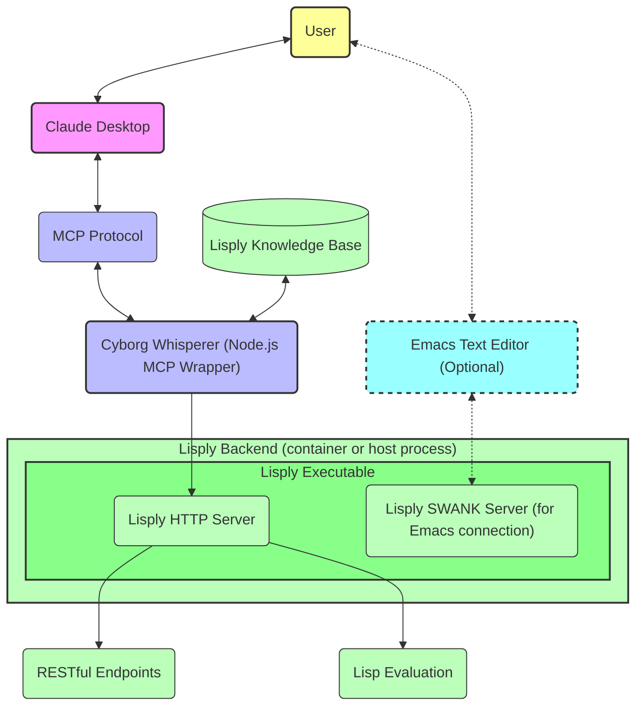

<!--
Copyright © 2026 Gornskew Enterprises

This program is free software: you can redistribute it and/or modify
it under the terms of the GNU Affero General Public License as
published by the Free Software Foundation, either version 3 of the
License, or (at your option) any later version.  Distributed WITHOUT
ANY WARRANTY; see <https://www.gnu.org/licenses/agpl-3.0.html>.
-->

# Cyborg Whisperer: a Protocol Officer for Lisp-Speaking Crews


Aboard a [Basilisk](https://github.com/gornskew/basilisk)-class
vessel, no cyborg wanders. Every visit — however it beams aboard — is
bound for a particular crew member, and every visit begins the same
way: with the **Protocol Officer**. He receives each arriving cyborg,
interviews it, schools it in the ship's ways, and dispatches it to
the crew member it came to see.

Cyborg Whisperer is the kit for that post — the species, if you like,
of which every Protocol Officer is a member. Post one beside any crew
member who answers the _Lisply_ dialect, aboard ship or ashore, and
arriving cyborgs find themselves received, educated, and set to
useful work.

Plainly: this project is a [Model Context Protocol
(MCP)](https://modelcontextprotocol.org) middleware that enables
[Large Language Models
(LLMs)](https://en.wikipedia.org/wiki/Large_language_model) — the
cyborgs — to interact with [Lisp-based](https://common-lisp.net/)
development and runtime environments — the crew — using a lightweight
protocol called _Lisply_.

**Note: This kit does not start or manage containers.** It is a pure
HTTP client to an already-running Lisply backend. Container lifecycle
is owned by docker compose — see "Running it" in the [Basilisk
README](https://github.com/gornskew/basilisk) — or run your own
Lisply backend directly on a host and point the wrapper at its
host/port. Once a backend is running, Claude Desktop connects to it
according to the example configurations below.

## Who Is this Meant For?

 - AI practitioners curious about Lisp
 - Lisp practitioners curious about AI
 - Anyone interested in Neuro-Symbolic Programming
 - Mechanical/Civil Engineers and Designers interested in CAD
   Automation and Knowledge Based Engineering
 - Tinkerers, meddlers, and tamperers from all walks of life

## What Is it Meant to Do?

The Cyborg Whisperer middleware connects
[MCP-capable](https://modelcontextprotocol.org) AI Agent programs, or
_MCP Clients_, such as
[ClaudeDesktop](https://www.anthropic.com/claude), to Lisp-based
systems which support a REPL, or Read-Eval-Print Loop. The connection
is meant to facilitate AI-assisted symbolic programming sometimes
referred to as _Neuro-Symbolic Programming_. We have coined the term
"Lisply" to refer to a lightweight protocol which most any Lisp-like
system can implement so that its resident may stand with a Protocol
Officer of his own.

The idea is that the LLM will be able to generate and evaluate
arbitrary Lisp expressions, including creating, compiling, loading,
and testing entire files and projects.

## Sandbox Trust Model

Lisply-backed MCP servers are intended to be exposed to the LLM as
**trusted sandboxes**. The wrapper is not designed to restrict Lisp
operators, filesystem access, or subprocess execution inside the
backend environment. Instead, the backend itself is expected to run in
an isolated container or other sandbox chosen by the operator.

This is intentional:

- `lisp_eval` is meant to support free-form, full use by LLMs.
- `/projects` may be a host-mounted working tree, but the rest of the
  backend filesystem may remain container-ephemeral.
- Trust decisions should therefore be made at the container/backend
  boundary, not by crippling Lisp evaluation in the MCP wrapper.

The wrapper now advertises this trust model in tool metadata with a
default `TRUST_AS_SANDBOX=true`. Operators can override the explanatory
text with `SANDBOX_NOTE` if needed.


## Extra Quick Start

Follow "Running it" in the [Basilisk
README](https://github.com/gornskew/basilisk) — `git clone` the yard,
then `./basilisk up`.

This will get you a Docker Compose setup including a preconfigured
containerized Protocol Officer already at his post beside the Captain.


## Quick Start

The following will get you up and running quickly with a minimal
default configuration and a default public Common Lisp based backend
running as a Docker container. See the main Contents below for more
background and detailed configuration options.

### 1. Install

1. Install Node.js (18+ recommended). If on Windows, this can be
   installed directly in Windows or in WSL.

2. Have a running Lisply backend to connect to. The easiest way is
   the docker compose stack from the [Basilisk
   README](https://github.com/gornskew/basilisk) (requires
   [Docker](https://docs.docker.com/engine/install/)); alternatively,
   run any Lisply-compliant backend directly on your host.

3. Clone this `cyborg-whisperer` repository to a location where your
   MCP-capable AI Agent (e.g. Claude Desktop) can access it.
   
 
### 2. Configure your MCP-capabile AI Agent

Edit or create your AI Agent's configuration file as shown below. In
the case of Claude Desktop, the configuration file is typically:


```
/mnt/c/Users/<user>/AppData/Roaming/Claude/claude_desktop_config.json
```

or 

```
c:\Users\<user>\AppData\Roaming\Claude\claude_desktop_config.json
```

In the example below, replace `/path/to/cloned/` with the correct path
to the `./scripts/mcp-wrapper.js` file from the cloned repo:

```json
{
  "mcpServers": {
    "gendl-ccl": {
      "command": "node",
      "args": [
        "/path/to/cloned/cyborg-whisperer/scripts/mcp-wrapper.js",
        "--server-name", "gendl-ccl",
        "--http-port", "9080"
      ]
    },
    "gendl-sbcl": {
      "command": "node",
      "args": [
        "/path/to/cloned/cyborg-whisperer/scripts/mcp-wrapper.js",
        "--server-name", "gendl-sbcl",
        "--http-port", "9090"
      ]
    },
    "readymax": {
      "command": "node",
      "args": [
        "/path/to/cloned/cyborg-whisperer/scripts/mcp-wrapper.js",
        "--server-name", "readymax",
        "--http-port", "7080"
      ]
    }
  }
}
```


Or in a WSL scenario (where the Claude Desktop is running in the
Windows host):


```json
{
  "mcpServers": {
    "gendl-ccl": {
      "command": "wsl",
      "args": [
        "node", "/path/to/cloned/cyborg-whisperer/scripts/mcp-wrapper.js",
        "--server-name", "gendl-ccl",
        "--http-port", "9080"
      ]
    },
    "gendl-sbcl": {
      "command": "wsl",
      "args": [
        "node", "/path/to/cloned/cyborg-whisperer/scripts/mcp-wrapper.js",
        "--server-name", "gendl-sbcl",
        "--http-port", "9090"
      ]
    },
    "readymax": {
      "command": "wsl",
      "args": [
        "node", "/path/to/cloned/cyborg-whisperer/scripts/mcp-wrapper.js",
        "--server-name", "readymax",
        "--http-port", "7080"
      ]
    }
  }
}
```


See the main Contents below for further configuration options, for
example how to specify an alternative Lisply backend service
host/port. (Sharing/mounting host directories into containerized
backends is configured in the docker compose setup, e.g. Basilisk's
`./basilisk`, not by this wrapper.)


Each server operates independently, allowing you to work with multiple
Lisp environments simultaneously without tool name conflicts.


### 3. Restart your AI Agent and Test

With the above configuration in place, your freshly restarted AI Agent
will now have access to an MCP server called `gendl-ccl`, with a
`gendl-ccl__lisp_eval` MCP tool (among a few other tools discussed in the main
Contents below). Note that tools are automatically prefixed with the server
name to avoid conflicts when running multiple Lisply servers.

In order to test your setup, you can prompt your LLM as follows:

>
> Evaluate `(+ 1 2 3)` using the gendl-ccl__lisp_eval tool, and let me know the
> result.
>

The LLM should invoke the requested evaluation and respond with `6` as
expected. Feel free to experiment with more complex expressions before
proceeding.


## How Does the Default Minimal Configuration Work?

The minimal default configuration described in the Quick Start above
connects to an already-running
[Gendl](https://gitlab.common-lisp.net/gendl/gendl) backend (for
example from a Basilisk stack), a Common Lisp
superset sporting a standard REPL (Read-Eval-Print Loop). The wrapper
itself never pulls or starts containers. Note a second Lisply backend implementation
for Emacs lisp also exists, within the
[Readymax](https://github.com/gornskew/readymax/tree/devo/dot-files/emacs.d/sideloaded/lisply-backend)
project (the ready room whose resident is the Captain).


## System Overview

The Cyborg Whisperer middleware is implemented as a Javascript program meant
to run in Node.js, and provides a bridge between your AI Agent and any
[compliant Lisply backend system](BACKEND-REQS.md). This wrapper
enables the AI Agent to:

1. Evaluate Lisp code in the Lisply Backend and receive the  results.
2. Make HTTP requests to any web endpoints implemented in the backend.
3. Access introspection and documentation lookup facilities in the LB
   using Lisp evaluation.
4. Create, manipulate, compile, load, and analyze files, again using
   Lisp evaluation.

[Lisply](./BACKEND-REQS.md) is a lightweight protocol that specifies a
minimal yet flexible set of HTTP interfaces, a standard set of
environment variables, and several optional capabilities to facilitate AI agents
controlling your running Lisp system.

## Architecture

The diagram below roughly captures how the components interact:



```mermaid
flowchart TB
    User("User") <--> Claude("Claude Desktop")
    User <-.-> Emacs("Emacs Text Editor (Optional)")

    Claude <--> MCP("MCP Protocol")
    MCP <--> Wrapper("Cyborg Whisperer (Node.js MCP Wrapper)")

    Wrapper --> LisplyHttp("Lisply HTTP Server")
    
    subgraph Backend ["Lisply Backend (container or host process)"]
    subgraph LisplyExec["Lisply Executable"]
    LisplyHttp
    LisplySwank("Lisply SWANK Server (for Emacs connection)")
    end
    end
    
    Emacs <-.-> LisplySwank
    
    KB[("Lisply Knowledge Base")] <--> Wrapper
    
    LisplyHttp --> Endpoints("RESTful Endpoints")
    LisplyHttp --> LispEval("Lisp Evaluation")
    
    style User fill:#ff9,stroke:#333,stroke-width:2px
    style Claude fill:#f9f,stroke:#333,stroke-width:2px
    style Emacs fill:#9ff,stroke:#333,stroke-width:2px,stroke-dasharray:5
    style Wrapper fill:#bbf,stroke:#333,stroke-width:2px
    style MCP fill:#bbf,stroke:#333,stroke-width:1px
    style Backend fill:#bfb,stroke:#333,stroke-width:2px
    style LisplyExec fill:#8f8,stroke:#333,stroke-width:2px
    style LisplyHttp fill:#bfb,stroke:#333,stroke-width:1px
    style LisplySwank fill:#bfb,stroke:#333,stroke-width:1px
    style KB fill:#bfb,stroke:#333,stroke-width:1px
    style Endpoints fill:#bfb,stroke:#333,stroke-width:1px
    style LispEval fill:#bfb,stroke:#333,stroke-width:1px
```

The middleware handles:
1. Translating Lisp evaluation requests between the MCP protocol and
   the backend [Lisply API](BACKEND-REQS.md)
2. Error handling and logging

## Security Considerations

Because Cyborg Whisperer allows arbitrary Lisp code to be evaluated against
a running Lisp-based backend, there are certain risks in case the LLM
were to go "haywire." Therefore, best practices are:

- Allow the wrapper to connect only to a containerized version of a
  Lisply backend. If overriding default host/port, the wrapper will
  happily connect to any live Lisply-compliant http port. Avoid
  allowing this to happen for any http ports being served by programs
  running directly on your host.

- Make sure not to mount any non-expendable directories into that
  container (directory mounting is configured in your docker compose
  setup, not by this wrapper)

- Consider taking steps to [limit RAM and CPU
  usage](https://docs.docker.com/engine/containers/resource_constraints/)
  of the container.
  

### Code Modules/Files

- **lib/config.js**: Configuration loading and environment handling
- **lib/logger.js**: Logging functionality 
- **lib/server.js**: HTTP server and MCP wrapper implementation
- **lib/utils.js**: Utility functions for response handling
- **handlers/**: Tool-specific request handlers
  - **initialize.js**: Initialization handler
  - **toolsList.js**: Tools list handler
  - **toolCall.js**: Main tool call dispatcher
  - **httpRequest.js**: HTTP request handler
  - **ping.js**: Ping handler
  - **lispEval.js**: Lisp evaluation handler
  - **skewedSearch.js**: Document-corpus search handler (backends
    that advertise it, e.g. Readymax rooms)
- **mcp-wrapper.js**: <--- Main entry point  <---


## Detailed Installation

1. Clone this repository:
```bash
git clone https://github.com/gornskew/cyborg-whisperer.git
```

2. Install the required dependencies (optional, as the wrapper auto-installs dependencies):
```bash
cd cyborg-whisperer/scripts
npm install # optional - the script will attempt to do this also if needed
chmod +x mcp-wrapper.js # needed on some systems
```

3. Test the script:
```bash
node mcp-wrapper.js --help
```

## Advanced Configuration

Optional settings for advanced users, with defaults suitable for most
cases:

### Command-Line Arguments

```bash
Options:
  -H, --backend-host <host>            Lisply backend host (default: 127.0.0.1)
  --http-host-port <port>              Backend HTTP port as published on this host; used when
                                       backend host is localhost/loopback (default: 9081)
  --http-port <port>                   Backend HTTP port inside the container network; used for
                                       non-local backend hosts (default: 9080)
  --swank-host-port <port>             SWANK port on host system (documentation/diagnostics) (default: 4201)
  --swank-port <port>                  SWANK port inside container (documentation/diagnostics) (default: 4200)
  --log-file <path>                    Path to log file (default: /tmp/lisply-mcp-wrapper.log)
  --debug                              Enable debug logging
  --endpoint-prefix <prefix>           Prefix for all endpoints (default: lisply)
  --lisp-eval-endpoint <n>             Endpoint name for Lisp evaluation (default: lisp-eval)
  --http-request-endpoint <n>          Endpoint name for HTTP requests (default: http-request)
  --ping-endpoint <n>                  Endpoint name for ping (default: ping-lisp)
  --server-name <name>                 MCP server name for tool prefixing (default: lisply-mcp)
  --eval-timeout <ms>                  Timeout for Lisp evaluation in milliseconds (default: 30000)
  --request-timeout-ms <ms>            Timeout for backend HTTP requests in milliseconds (default: 10000)
  -h, --help                           Display help for command
```

### Environment Variables

The script also supports configuration via environment variables. You
can specify variables with the "LISPLY_" prefix or with no prefix:

**Note:** It is important to keep straight the difference between host
ports (listening on and reachable from the host system) and container
ports (internal to the container, visible to the Lisply backend
service process):

| Environment Variable | Description | Default |
|----------------------|-------------|---------|
| `BACKEND_HOST` or `LISPLY_BACKEND_HOST` | Lisply backend host | 127.0.0.1 |
| `HTTP_HOST_PORT` or `LISPLY_HTTP_HOST_PORT` | Backend HTTP port as published on this host (loopback backends) | 9081 |
| `HTTP_PORT` or `LISPLY_HTTP_PORT` | Backend HTTP port inside the container network (non-local backends) | 9080 |
| `SWANK_HOST_PORT` or `LISPLY_SWANK_HOST_PORT` | SWANK port on host system (documentation/diagnostics) | 4201 |
| `SWANK_PORT` or `LISPLY_SWANK_PORT` | SWANK port inside container (documentation/diagnostics) | 4200 |
| `LOG_FILE` or `LISPLY_LOG_FILE` | Path to log file | /tmp/lisply-mcp-wrapper.log |
| `DEBUG_MODE` or `LISPLY_DEBUG_MODE` | Enable debug logging | false |
| `EVAL_TIMEOUT` or `LISPLY_EVAL_TIMEOUT` | Timeout for Lisp evaluation in ms | 30000 |
| `REQUEST_TIMEOUT_MS` or `LISPLY_REQUEST_TIMEOUT_MS` | Timeout for backend HTTP requests in ms | 10000 |
| `ENDPOINT_PREFIX` or `LISPLY_ENDPOINT_PREFIX` | Prefix for all endpoints | lisply |
| `LISP_EVAL_ENDPOINT` or `LISPLY_LISP_EVAL_ENDPOINT` | Endpoint name for Lisp evaluation | lisp-eval |
| `HTTP_REQUEST_ENDPOINT` or `LISPLY_HTTP_REQUEST_ENDPOINT` | Endpoint name for HTTP requests | http-request |
| `PING_ENDPOINT` or `LISPLY_PING_ENDPOINT` | Endpoint name for ping | ping-lisp |
| `SERVER_NAME` or `LISPLY_SERVER_NAME` | MCP server name for tool prefixing | lisply-mcp |
| `TRUST_AS_SANDBOX` or `LISPLY_TRUST_AS_SANDBOX` | Advertise backend as an explicitly trusted sandbox in tool metadata | true |
| `SANDBOX_NOTE` or `LISPLY_SANDBOX_NOTE` | Override the sandbox-note text shown in tool metadata | (built-in note) |

## Container Lifecycle: Docker Compose, Not This Wrapper

Earlier versions of this wrapper could pull, start, and manage backend
Docker containers itself (image selection, volume mounting, auto-start,
existing-service detection). That entire subsystem has been removed.
The wrapper is now a pure HTTP client: it connects to whatever Lisply
backend is already listening at the configured host and port, and
reports a helpful error (with a compose hint) when nothing is there.

For a containerized backend stack (Gendl, Readymax, etc.), use
Basilisk, the compose framework at
`gitlab.genworks.com:gornskew/basilisk` (`./basilisk up`),
which owns image selection, volume mounting, port publishing, and UID
mapping. For a non-containerized backend, start any Lisply-compliant
server yourself (e.g. the host-Emacs path described in readymax
`docs/HOST_EMACS_MCP.md`) and point the wrapper at its host and port.

## Communication

Two links are involved, and they are easy to conflate:

1. **AI Agent ↔ wrapper**: MCP protocol over standard input/output
   (the standard MCP stdio transport). This is JSON-RPC plumbing
   managed by your MCP client, unrelated to any backend REPL.

2. **Wrapper ↔ backend**: HTTP only. The wrapper POSTs to the
   backend's Lisply HTTP endpoints and returns structured responses.

**Characteristics of the HTTP backend link:**
- Structured responses with separate result, stdout, and error fields
- Errors are trapped by the backend and returned as strings
- Response format: `{Result: <result>, Stdout: <output>, Error: <any error>}`

**Example response:**
```
{"Result": "6", "Stdout": "This is a message to standard output"}
```

An earlier "stdio mode", which talked to a wrapper-started
container's raw REPL (interactive debugger, incremental output), was
removed along with container auto-starting. Equivalent capabilities
may return at the HTTP layer in the future (e.g. a restarts endpoint,
streamed output) without re-coupling the wrapper to container
lifecycle.

## Usage Examples 

All the examples below can be tested on command line and used in
`claude_desktop_config.json` configuration (see the Quick Start
configuration examples above).

## Adding a Separate, Compatible Filesystem MCP Server

Below is a `claude_desktop_config.json` which sets up a filesystem mcp
server as well as our `lisply-gendl` server. (The filesystem
server gets its mount here; any mounts into a containerized Lisply
backend are configured in the compose setup, not by this wrapper.)


```json
{
  "mcpServers": {
    "filesystem": {
      "command": "wsl",
      "args": [
        "docker",
        "run",
        "-i",
        "--rm",
        "-u",
        "1000:1000",
        "--mount",
        "type=bind,src=/home/user/projects,dst=/projects",
        "mcp/filesystem",
        "/projects"
      ]
    },
    "lisply-gendl": {
      "command": "wsl",
      "args": [
        "node",
        "/home/user/projects/cyborg-whisperer/scripts/mcp-wrapper.js",
        "--server-name", "gendl"
      ]
    }
  },
  "globalShortcut": ""
}
```

### Tool Details for Claude

#### Lisp Evaluation Tool (`<server>__lisp_eval`)

The `lisp_eval` tool (prefixed with the server name, e.g., `gendl__lisp_eval`) 
allows Claude to evaluate Lisp code directly within the Lisply environment 
with these parameters:

- `code` (required): The Lisp code to evaluate
- `package` (optional): The package to use for the evaluation

#### HTTP Request Tool (`<server>__http_request`)

The `http_request` tool (prefixed with the server name, e.g., `gendl__http_request`) 
enables the AI Agent to interact with any HTTP endpoint exposed by the Lisply 
backend (the following example works with our default backend, which has a 
built-in `/color-map` http endpoint):

```json
{
  "path": "/color-map",
  "method": "GET",
  "headers": {
    "Accept": "application/json"
  }
}
```

#### Ping Tool (`<server>__ping_lisp`)

The `ping_lisp` tool (prefixed with the server name, e.g., `gendl__ping_lisp`) 
lets Claude confirm that the Lisply server is running:

```
<server>__ping_lisp()
```

## Real-World Examples

### Example 1: Creating a Parametric Box

In this example, Claude creates a parametric box in the Lisply
environment and then modifies its properties based on user
requirements.

**User**: "Can you create a box with width 10, height 5, and depth 3?
Then show me how to change the height to 8."

**Claude**:

I'll create a parametric box using the lisp_eval tool, then show you
how to modify its height.

First, let's create the box with the specified dimensions:

```lisp
(in-package :gdl-user)

;; First, create a box with the specified dimensions
(defparameter *my-box* (make-object 'box 
                         :width 10 
                         :height 5 
                         :length 3))

;; Let's verify the dimensions
(list (theo *my-box* width)
      (theo *my-box* height)
      (theo *my-box* length))
```

Now, let's change the height from 5 to 8:

```lisp
;; Change the height using setf with accessor
(theo *my-box* (set-slot! :height 8))

;; Alternatively, we could create a new box
(defparameter *new-box* (make-object 'box 
                         :width 10 
                         :height 8  ;; Updated height
                         :length 3))

;; Verify the new dimensions of original box
(list (theo *my-box* width)
      (theo *my-box* height)
      (theo *my-box* length))
```

This box can be visualized by creating a web interface or using a
built-in gendl visualization tool such as `geysr`. See [Gendl
Documentation](https://gornschool.com) for details.


## Troubleshooting

### Common Issues and Solutions

#### Backend Not Running

If the wrapper reports it cannot reach the backend:

1. For the containerized stack, make sure the compose services are up:
```bash
cd ~/projects/basilisk && ./basilisk up
```

2. Check whether anything is listening on the expected port:
```bash
curl http://localhost:9081/lisply/ping-lisp
```

#### Connection Errors

If the LLM Agent / MCP Client cannot connect to the configured Lisply
backend:

1. Check if the Lisply server is running (for the compose stack):
```bash
docker ps    # the stack's containers should be listed and healthy
```


2. Check the wrapper's log file:
```bash
tail -f /tmp/lisply-mcp-wrapper.log
```

3. Check the Claude Desktop log file with Windows tools
   e.g. Notepad. This is typically in a location such as:

WSL/Linux:
```
/mnt/c/Users/<user>/AppData/Roaming/Claude/logs/mcp-server-lisply.log
```

Windows:
```
c:\Users\<user>\AppData\Roaming\Claude\logs\mcp-server-lisply.log
```


5. Try curling to the Lisply HTTP server:
```bash
curl http://localhost:9081/lisply/ping-lisp
```

6. Try connecting to the Lisply SWANK server (on default port 4201):
```bash
M-x slime-connect  ;; from emacs
```

Note that setting up the
[Readymax](https://github.com/gornskew/readymax) configuration
will enable `M-x slime-connect` in your emacs.

#### Permission Issues

If you encounter file-ownership surprises in a directory mounted into
a containerized backend, remember mounts and UID mapping are
configured in the compose setup, not by this wrapper. Check the
mounted directory permissions:
```bash
ls -l /path/to/mounted/directory
```

### Diagnostic Commands

Use these commands to diagnose general issues:

1. Check the middleware logs:
```bash
tail -f /tmp/lisply-mcp-wrapper.log
```

2. Check backend container logs (for the compose stack):
```bash
cd ~/projects/basilisk && ./basilisk logs
```

3. Check Lisply service status:
```bash
curl http://localhost:9081/lisply/ping-lisp
```

4. Verify Docker environment:
```bash
docker system info
```

## License

This software is licensed under the GNU Affero General Public License
v3.0 (AGPL-3.0), the same license used by Gendl.

### License Implications

Simply using this MCP server to interact with a Lisply backend and
obtain outputs does not trigger the requirements of the AGPL, e.g. you
can use this wrapper to interact with Gendl without being required to
share your code.

However, if you modify or extend this wrapper, or a license-compatible
Lisply backend such as Gendl, and wish to distribute and/or host a
service based on that result (commercial or not), then the AGPL would
require you to share your modifications with the downstream recipients
or users. 

For applications that need to keep their source code closed, Genworks
has begun offering an "escape clause" from AGPL restrictions for a 5%
self-reported quarterly revenue royalty. More information and a
payment gateway are available at
[royalties.genworks.com](https://royalties.genworks.com).

The full text of the license can be found in the COPYING.txt file in
this directory. 

## MCP Server Registries

- [MCPHub](https://mcphub.com/mcp-servers/gornskew/lisply-mcp)

